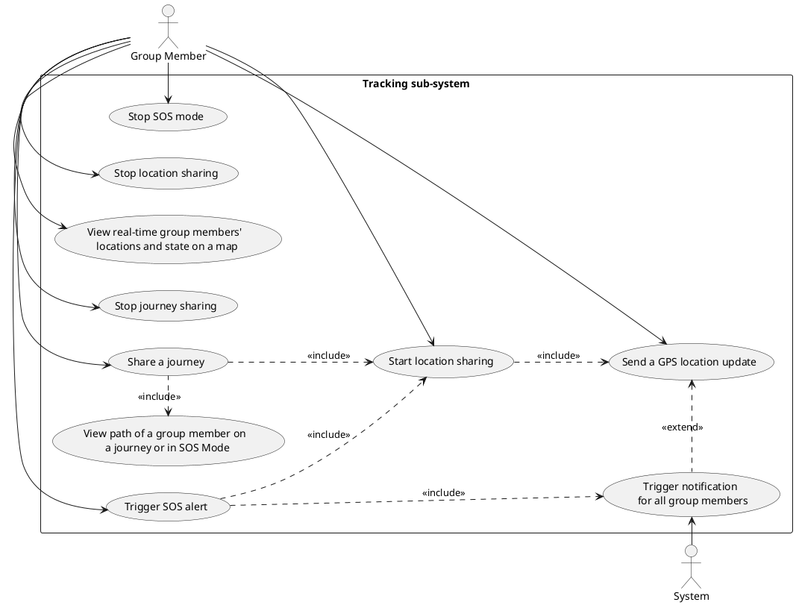

## Glossary

## Use cases

### Location Tracking

1. **Start Location Sharing**

   - **Actor**: Group member
   - **Description**: The user starts sharing their location with members of one or more groups.
   - **Preconditions**:
     - The user is logged and is a member of the group they want to share their location with.
   - **Main Scenario**:
     1. The user selects the group they want to share their location with;
     2. The user starts sharing their location with members of that group;
     3. A visual feedback is sent to the user notifying them the location sharing has started.
   - **Postcondition**: The user's location is shared with the selected group members.

2. **Stop Location Sharing**

    - **Actor**: Group member
    - **Description**: The user stops sharing their location with members of one or more groups.
    - **Preconditions**:
      - The user is logged and is a member of the group they want to stop sharing their location with;
      - The user is currently sharing their location.
    - **Main Scenario**:
      1. The user selects the group they want to stop sharing their location with;
      2. The user stops sharing their location;
      3. A visual feedback is sent to the user notifying them the location sharing has been turned off;
    - **Postcondition**: The user's location is no longer shared with the selected group members.

3. **Send a GPS Location Update**

    - **Actor**: Group member
    - **Description**: The user sends a GPS location update to the system for a specific set of groups.
    - **Preconditions**:
      - The user is logged and is a member of the group they want to send the location to;
    - **Main Scenario**:
      1. The user sends a GPS location update;
      2. The system updates the user's location.
    - **Alternative Scenario**: The user have triggered the SOS
      1. The user sends a GPS location update;
      2. The system updates the user's location and their path in SOS mode.
    - **Alternative Scenario**: The user is sharing a journey.
      1. The user sends a GPS location update;
      2. The system updates the user's location and the path of the journey;
      3. The system verify if the user have reached the destination. If so, stops the journey sharing, otherwise it continues;
      4. The system verify if the user is stuck or the ETA is elapsed. If so, trigger a notification for all group members.
    - **Postcondition**: The user's location is updated server-side and their state is 'Active'.

4. **View Real-time Group Members' Locations and State on a Map**

    - **Actor**: Group member
    - **Description**: The user views the real-time locations and state of group members on a map.
    - **Preconditions**: 
      - The user is logged and is a member of the group they want to view.
    - **Main Scenario**:
      1. The user selects the group they want to view;
      2. The user views the real-time locations and state of all group members on a map.

5. **Trigger SOS Alert**

    - **Actor**: Group member
    - **description**: The user triggers an SOS alert because they are in danger.
    - **Preconditions**:
      - The user is logged and is part of at least one group;
      - The user is not already in SOS mode.
    - **Main Scenario**:
      1. The user triggers the SOS alert;
      2. The system updates the user's location and enters SOS mode, starting recording their path;
      3. The system sends a notification to all group members.
    - **Postcondition**: The user is in 'SOS' mode.

6. **Stop SOS Mode**

    - **Actor**: Group member
    - **Description**: The user stops the SOS mode.
    - **Preconditions**:
      - The user is logged and is part of at least one group;
      - The user is in SOS mode.
    - **Main Scenario**:
      1. The user stops the SOS mode;
      2. The system stops recording the user's path;
      3. The system sends a notification to all group members;
    - **Postcondition**: The user is no longer in 'SOS' mode, but in 'Active' mode.

7. **Share a Journey**

    - **Actor**: Group member
    - **description**: The user start sharing a journey with a group;
    - **Preconditions**:
      - The user is logged and is part of the group they want to share the journey with;
      - The user is not sharing a journey.
    - **Main Scenario**:
      1. The user selects the group they want to share the journey with;
      2. The user starts sharing the journey by choosing the destination and the estimated time of arrival;
      3. The system sends a notification to all group members.
    - **Postcondition**: The user is sharing the journey and their state is 'Routing'.

8. **Stop Journey Sharing**

    - **Actor**: Group member
    - **Description**: The user stops sharing the journey.
    - **Preconditions**:
      - The user is logged and is part of the group they want to stop sharing the journey with;
      - The user is sharing a journey.
    - **Main Scenario**:
      1. The user selects the group they want to stop sharing the journey with;
      2. The user stops sharing the journey;
      3. The system sends a notification to all group members that the journey sharing has been stopped.
    - **Postcondition**: The user is no longer sharing the journey and their state is 'Active'.

9. **View Path of a Group Member on a Journey or in SOS Mode**

    - **Actor**: Group member
    - **Description**: The user views the path of a group member on a journey or in SOS mode.
    - **Preconditions**:
      - The user is logged and is part of the group they want to view the path of a group member;
    - **Main Scenario**:
      1. The user selects the group they want to view the path of a group member;
      2. The user selects the group member they want to view the path of;
      3. The user views the path of the selected group member on a map.
    - **Postcondition**: The user has viewed the path of the selected group member.
