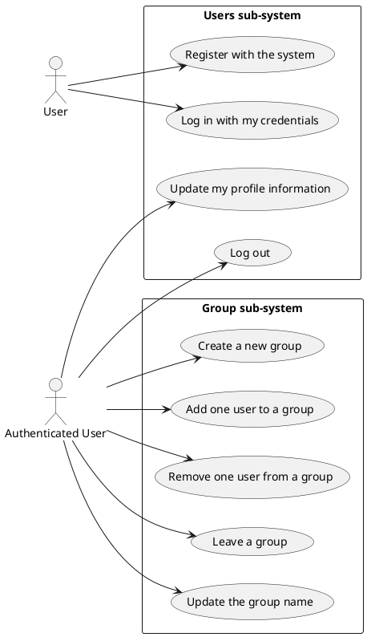
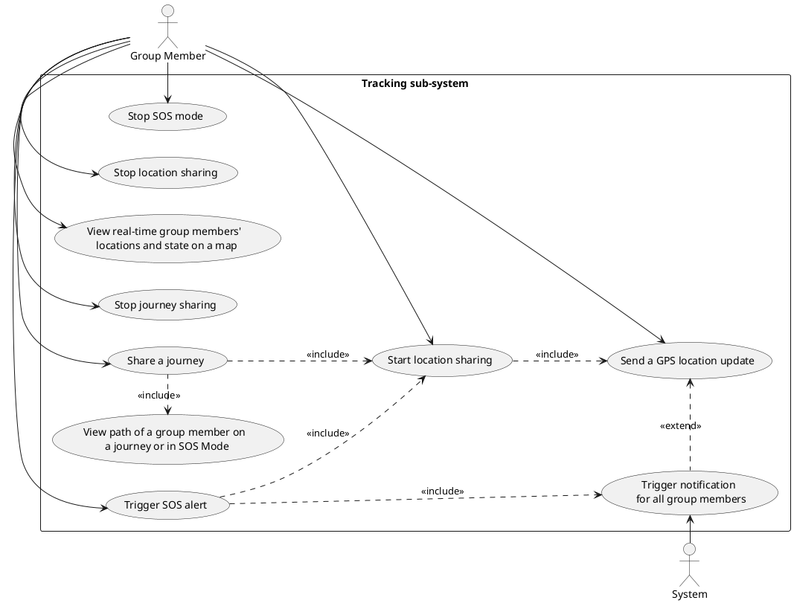
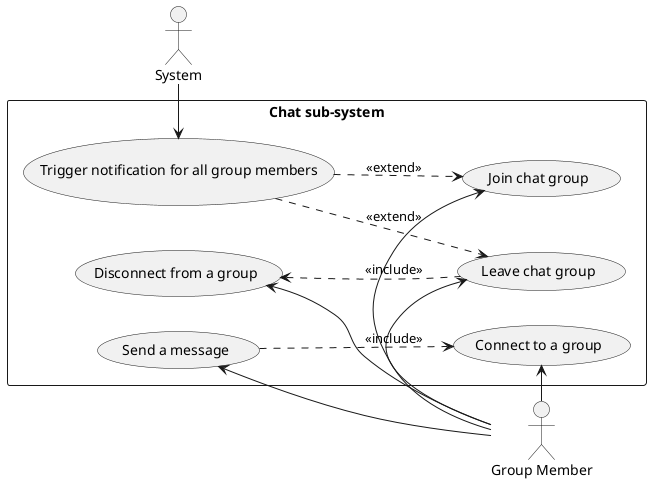

## Use cases

### Users and Groups Management

### User Management Use Cases

1. **Register with the system**

   - **Actor**: User
   - **Description**: A new user creates an account in the system.
   - **Preconditions**:
     - The user has not previously registered with the system.
   - **Main Scenario**:
     1. The user provides required registration information;
     2. The system validates the provided information;
     3. The system creates a new user account;
   - **Alternative Scenario**: Registration information is invalid
     1. The system notifies the user about validation errors;
     2. The user corrects the information and resubmits.
   - **Postcondition**: The user has a registered account in the system.

2. **Log in with my credentials**

   - **Actor**: User
   - **Description**: A registered user authenticates to access the system.
   - **Preconditions**:
     - The user has a registered account in the system.
   - **Main Scenario**:
     1. The user enters their credentials;
     2. The system validates the credentials;
     3. The system grants access to the user and creates an authenticated session.
   - **Alternative Scenario**: Invalid credentials
     1. The system notifies the user that the credentials are incorrect;
     2. The user re-enters the correct credentials.
   - **Postcondition**: The user is authenticated and can access restricted functionalities.

3. **Update my profile information**

   - **Actor**: Authenticated User
   - **Description**: An authenticated user modifies their personal information in the system.
   - **Preconditions**:
     - The user is logged in to the system.
   - **Main Scenario**:
     1. The user accesses their profile settings;
     2. The user modifies the desired information;
     3. The user confirms the changes;
     4. The system validates and saves the updated information.
   - **Alternative Scenario**: Invalid information
     1. The system notifies the user about validation errors;
     2. The user corrects the information and resubmits.
   - **Postcondition**: The user's profile information is updated in the system.

4. **Log out**

   - **Actor**: Authenticated User
   - **Description**: An authenticated user ends their current session.
   - **Preconditions**:
     - The user is logged in to the system.
   - **Main Scenario**:
     1. The user selects the logout option;
     2. The system terminates the user's authenticated session;
     3. The system redirects the user to the unauthenticated state.
   - **Postcondition**: The user is no longer authenticated and cannot access restricted functionalities.

### Group Management Use Cases

5. **Create a new group**

   - **Actor**: Authenticated User
   - **Description**: An authenticated user creates a new group in the system.
   - **Preconditions**:
     - The user is logged in to the system.
   - **Main Scenario**:
     1. The user selects the option to create a new group;
     2. The user provides a group name;
     3. The system creates the new group with the user as the initial member;
     4. The system confirms the successful creation of the group.
   - **Postcondition**: A new group exists in the system with the user as a member.

6. **Add one user to a group**

   - **Actor**: Authenticated User
   - **Description**: An authenticated user adds another user to a group.
   - **Preconditions**:
     - The user is logged in to the system;
     - The user is a member of the group;
     - The target user exists in the system.
   - **Main Scenario**:
     1. The user selects the group they want to add a user to;
     2. The user enters the email of the user they want to add;
     3. The user confirms adding the selected user to the group;
     4. The system adds the selected user as a member of the group;
     5. The system notifies both users about the addition.
   - **Alternative Scenario**: The target user is already a member
     1. The system notifies the user that the target is already a group member.
   - **Postcondition**: The target user is now a member of the group.

7. **Remove one user from a group**

   - **Actor**: Authenticated User
   - **Description**: An authenticated user removes another user from a group.
   - **Preconditions**:
     - The user is logged in to the system;
     - The user is a member of the group;
     - The target user is a member of the group.
   - **Main Scenario**:
     1. The user selects the group they want to remove a user from;
     2. The user selects the group member to remove;
     3. The user confirms removing the selected user from the group;
     4. The system removes the selected user's membership from the group;
   - **Postcondition**: The target user is no longer a member of the group.

8. **Leave a group**

   - **Actor**: Authenticated User
   - **Description**: An authenticated user leaves a group they belong to.
   - **Preconditions**:
     - The user is logged in to the system;
     - The user is a member of the group.
   - **Main Scenario**:
     1. The user selects the group they want to leave;
     2. The user confirms leaving the group;
     3. The system removes the user's membership from the group;
   - **Postcondition**: The user is no longer a member of the group.

9. **Update the group name**

   - **Actor**: Authenticated User
   - **Description**: An authenticated user changes the name of a group.
   - **Preconditions**:
     - The user is logged in to the system;
     - The user is a member of the group.
   - **Main Scenario**:
     1. The user selects the group they want to rename;
     2. The user enters a new name for the group;
     3. The user confirms the name change;
     4. The system updates the group name;
   - **Postcondition**: The group now has the new name in the system.

### Location Tracking

1. **Start Location Sharing**

   - **Actor**: Group member
   - **Description**: The user starts sharing their location with members of one or more groups.
   - **Preconditions**:
     - The user is logged and is a member of the group they want to share their location with.
   - **Main Scenario**:
     1. The user selects the group they want to share their location with;
     2. The user starts sharing their location with members of that group;
     3. A visual feedback is sent to the user notifying them the location sharing has started.
   - **Postcondition**: The user's location is shared with the selected group members.

2. **Stop Location Sharing**

    - **Actor**: Group member
    - **Description**: The user stops sharing their location with members of one or more groups.
    - **Preconditions**:
      - The user is logged and is a member of the group they want to stop sharing their location with;
      - The user is currently sharing their location.
    - **Main Scenario**:
      1. The user selects the group they want to stop sharing their location with;
      2. The user stops sharing their location;
      3. A visual feedback is sent to the user notifying them the location sharing has been turned off;
    - **Postcondition**: The user's location is no longer shared with the selected group members.

3. **Send a GPS Location Update**

    - **Actor**: Group member
    - **Description**: The user sends a GPS location update to the system for a specific set of groups.
    - **Preconditions**:
      - The user is logged and is a member of the group they want to send the location to;
    - **Main Scenario**:
      1. The user sends a GPS location update;
      2. The system updates the user's location.
    - **Alternative Scenario**: The user have triggered the SOS
      1. The user sends a GPS location update;
      2. The system updates the user's location and their path in SOS mode.
    - **Alternative Scenario**: The user is sharing a journey.
      1. The user sends a GPS location update;
      2. The system updates the user's location and the path of the journey;
      3. The system verify if the user have reached the destination. If so, stops the journey sharing, otherwise it continues;
      4. The system verify if the user is stuck or the ETA is elapsed. If so, trigger a notification for all group members.
    - **Postcondition**: The user's location is updated server-side and their state is 'Active'.

4. **View Real-time Group Members' Locations and State on a Map**

    - **Actor**: Group member
    - **Description**: The user views the real-time locations and state of group members on a map.
    - **Preconditions**: 
      - The user is logged and is a member of the group they want to view.
    - **Main Scenario**:
      1. The user selects the group they want to view;
      2. The user views the real-time locations and state of all group members on a map.

5. **Trigger SOS Alert**

    - **Actor**: Group member
    - **description**: The user triggers an SOS alert because they are in danger.
    - **Preconditions**:
      - The user is logged and is part of at least one group;
      - The user is not already in SOS mode.
    - **Main Scenario**:
      1. The user triggers the SOS alert;
      2. The system updates the user's location and enters SOS mode, starting recording their path;
      3. The system sends a notification to all group members.
    - **Postcondition**: The user is in 'SOS' mode.

6. **Stop SOS Mode**

    - **Actor**: Group member
    - **Description**: The user stops the SOS mode.
    - **Preconditions**:
      - The user is logged and is part of at least one group;
      - The user is in SOS mode.
    - **Main Scenario**:
      1. The user stops the SOS mode;
      2. The system stops recording the user's path;
      3. The system sends a notification to all group members;
    - **Postcondition**: The user is no longer in 'SOS' mode, but in 'Active' mode.

7. **Share a Journey**

    - **Actor**: Group member
    - **description**: The user start sharing a journey with a group;
    - **Preconditions**:
      - The user is logged and is part of the group they want to share the journey with;
      - The user is not sharing a journey.
    - **Main Scenario**:
      1. The user selects the group they want to share the journey with;
      2. The user starts sharing the journey by choosing the destination and the estimated time of arrival;
      3. The system sends a notification to all group members.
    - **Postcondition**: The user is sharing the journey and their state is 'Routing'.

8. **Stop Journey Sharing**

    - **Actor**: Group member
    - **Description**: The user stops sharing the journey.
    - **Preconditions**:
      - The user is logged and is part of the group they want to stop sharing the journey with;
      - The user is sharing a journey.
    - **Main Scenario**:
      1. The user selects the group they want to stop sharing the journey with;
      2. The user stops sharing the journey;
      3. The system sends a notification to all group members that the journey sharing has been stopped.
    - **Postcondition**: The user is no longer sharing the journey and their state is 'Active'.

9. **View Path of a Group Member on a Journey or in SOS Mode**

    - **Actor**: Group member
    - **Description**: The user views the path of a group member on a journey or in SOS mode.
    - **Preconditions**:
      - The user is logged and is part of the group they want to view the path of a tracked group member;
    - **Main Scenario**:
      1. The user selects the group they want to view the path of a group member;
      2. The user selects the group member they want to view the path of;
      3. The user views the path of the selected group member on a map.
    - **Postcondition**: The user has viewed the path of the selected group member.

### Chat management

1. **Join chat group**

   - **Actor**: Group Member
   - **Description**: User joins a chat group.
   - **Preconditions**:
     - The user doesn't already belong to the chat group.
   - **Main Scenario**:
     1. A chat participant selects the user to join the chat group;
     2. User joins the chat;
     3. Other clients receive an information message that the user joined the chat group.
   - **Postcondition**: User now belongs to the chat.

2. **Leave chat group**

   - **Actor**: Group Member
   - **Description**: User leaves a chat group.
   - **Preconditions**:
     - The user belongs to the chat group.
   - **Main Scenario**:
     1. A chat participant selects a user that should be kicked from the chat group;
     2. User is now kicked from the chat;
     3. Other clients receive an information message that a user leaved the chat group.
   - **Postcondition**: User now doesn't belongs to the chat.

3. **Send a message**

   - **Actor**: Group Member
   - **Description**: User sends a message in a chat group.
   - **Preconditions**:
     - The user belongs to the chat group;
     - The user is online.
   - **Main Scenario**:
     1. User sends a message from a client application;
     2. The message is then propagated to the other users of the group;
     3. Other clients of the users that belongs to the group receives the messages.
   - **Postcondition**: A new message is sent in the chat.

4. **Connect a client**

   - **Actor**: Group Member
   - **Description**: User becomes online and can receive messages.
   - **Preconditions**:
     - The user belongs to the chat group;
     - The user is offline.
   - **Main Scenario**:
     1. User logs in to the position-pal application;
     2. The client is registered in an online status;
     3. Other clients receive an information message that a user have became online.
   - **Postcondition**: Client pass in an online status.

5. **Disconnect from a group**

   - **Actor**: Group Member
   - **Description**: User becomes offline and can't receive messages.
   - **Preconditions**:
     - The user belongs to the chat group;
     - The user is online.
   - **Main Scenario**:
     1. User disconnects from the position-pal application;
     2. The client is registered in an offline status;
     3. Other clients receive an information message that a user have became offline.
   - **Postcondition**: Client pass in an offline status.
