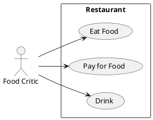

## Glossary

## Use cases

for each use case "boundary"

- use case diagram
- related specification in terms of main scenario, precondition, postcondition, and alternative scenarios

```plantuml
@startuml food-use-case
left to right direction
actor "Food Critic" as fc
rectangle Restaurant {
  usecase "Eat Food" as UC1
  usecase "Pay for Food" as UC2
  usecase "Drink" as UC3
}
fc --> UC1
fc --> UC2
fc --> UC3
@enduml
```
