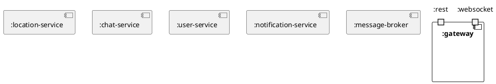

```plantuml
@startuml architecture-cc
'=========================[ Styling ]=========================='
skinparam component {
    BackgroundColor<<external>> White
    BackgroundColor<<executable>> #ccffcc
    BackgroundColor<<test>> cyan
}
skinparam DatabaseBackgroundColor LightYellow
skinparam NodeBackgroundColor White
'========================[ Components ]========================'
component ":gateway" {
    portin ":rest" as GATEWAT_REST
    portin ":websocket" as GATEWAY_WEBSOCKET
}

component ":location-service" {

}

component ":chat-service" {

}

component ":user-service" {

}

component ":notification-service" {

}

component ":message-broker" {

}
@enduml
```
