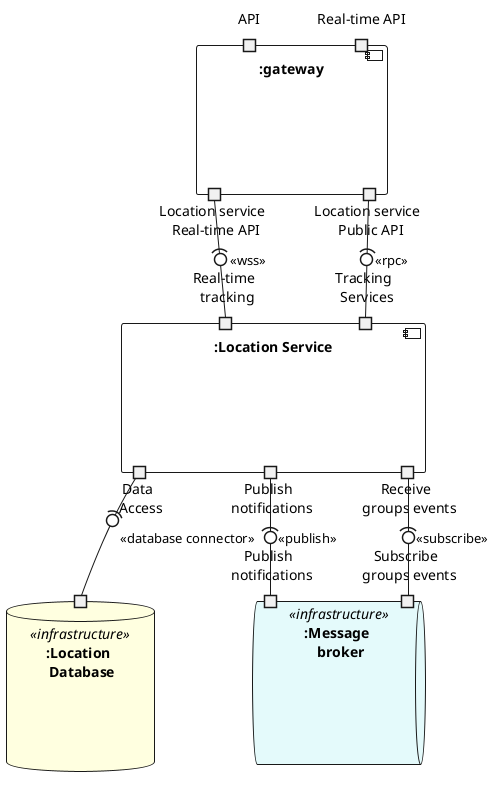
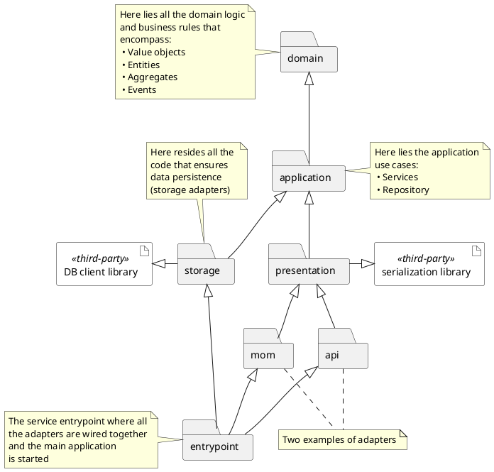

The chosen architectural style for the system is the **Microservices Architecture**.

`TODO: why, advantages`

## Microservices Decomposition

Following the _decompose by subdomain strategy_ the following microservices have been identified:

- **User Service**: responsible for managing the user account data and the groups of the system;
- **Location Service**: responsible for managing the location and the user tracking;
- **Notification Service**: responsible for managing the notifications;
- **Chat Service**: responsible for managing the chat messages.

It should be noted that in the _User Service_ we have joined together the Users and Groups bounded context.
This is because one can see the close interaction between these two domain entities in addition to respecting properties such as the "Common Closure Principle" (package components that change for the same reason are located into the same service), ensuring data consistency and mitigate Network latency:

Moreover, to aggregate the functionalities of the different microservices, we have chosen to use the **API Gateway** pattern. This pattern is used to aggregate the functionalities of the architecture, providing a single entry point for the client applications.
The API Gateway is responsible for routing the requests to the appropriate service, aggregating the responses, and providing a unified interface to the client applications.

## Architecture Documentation

### High-Level Overview

**To address the challenges of scalability, decoupling, and real-time processing, the system's architecture was designed following an event-driven microservice approach, in which the microservices are mainly designed to _interact_ by means of event streams.**

This paradigm enables _asynchronous communication_ between the services, allowing them to be _loosely coupled_ and _independent_ from each other, hence making the system more _resilient_ and _maintainable_.

For this purpose, the architecture is designed around a **Message/Event Broker**, which acts as a central communication hub for the microservices, enabling them to _publish_ and _subscribe_ to events, and _exchange messages_ in a _reliable_ and _scalable_ way.

Nonetheless, regarding the communications between the client and the microservices through the API Gateway, an RPC protocol is used, in order to ensure synchronous communication.
This approach enables the client to _invoke_ remote procedures on the microservices and receive a response in a synchronous manner (e.g. for the authentication process).

Lastly, each microservice follow the best practice of having **its own database**, ensuring _data isolation_ and _independence_ from other services, allowing a _loosely coupled_ architecture whose communications happen **only** through the message broker via a standard protocol.
This has also the advantage of letting the developers change a service's schema without affecting, and thus coordinating, with other services teams.

Following these high-level principles, in the following sections we provide a detailed view of the system's architecture, though the three main strucutural views: _Components and Connectors_, _Modules_ and _Allocation_.

### C&C View

The following diagrams shows the _Component and Connector_ (C&C) view of the system, providing a high-level picture of the system's runtime entities in action and their boundaries.

In order to avoid overwhelming the reader with an all-encompassing but rather confusing scheme, we provide below a C&C view of the system by providing, for each microservice, its relative UML diagram.

#### Location Service



<!-- 
```plantuml
@startuml arch-cc-chat

@enduml
``` -->

#### Notification service

```plantuml
@startuml arch-cc-notification
'========================== Styling =========================='
skinparam component {
    BackgroundColor<<external>> #eeebeb
    BackgroundColor<<executable>> #e3f6e3
}
skinparam DatabaseBackgroundColor LightYellow
skinparam QueueBackgroundColor #e4fafb
'========================= Components ========================'
component ":notification-service" {
    portout "Data Access" as NOT_DA
    portout "Receive groups \n updates" as NOT_SUB_GRPS
    portout "Receive \n notifications \n commands" as NOT_SUB_NOTIF
}
database ": Notification \n Service \n Database" as  NOT_DB {
    portin " " as NOT_DB_DA
}
NOT_DA -(0- NOT_DB_DA : <<database connector>>

queue ":Message \n broker" <<infrastructure>> {
    portin "Notifications \n topic" as MB_SUB_NOTIF
    portin "Group events \n topic" as MB_SUB_GRPS
}
NOT_SUB_GRPS -0)- MB_SUB_GRPS
NOT_SUB_NOTIF -0)- MB_SUB_NOTIF
@enduml
```

### Deployment View

## Hexagonal Architecture

In compliance with DDD principles, the microservices are designed following the **Hexagonal Architecture** pattern (also known as _Ports and Adapters_ or _Onion Architecture_), which is a particular instantiation of the layered architecture, that is well-suited for microservices to preserve models' integrity.
Indeed, the primary advantage of this pattern is the separation of concerns, which allows the business logic to be decoupled from the infrastructure and the external systems (e.g., databases, message brokers, etc.) hence making the system more maintainable and testable, and the business logic more reusable.


Each layer of the Hexagonal Architecture has been enforced in the code by mapping them into modules (like Grade submodules) each of which with its own build dependencies and responsibilities, as shown in the following diagram:


