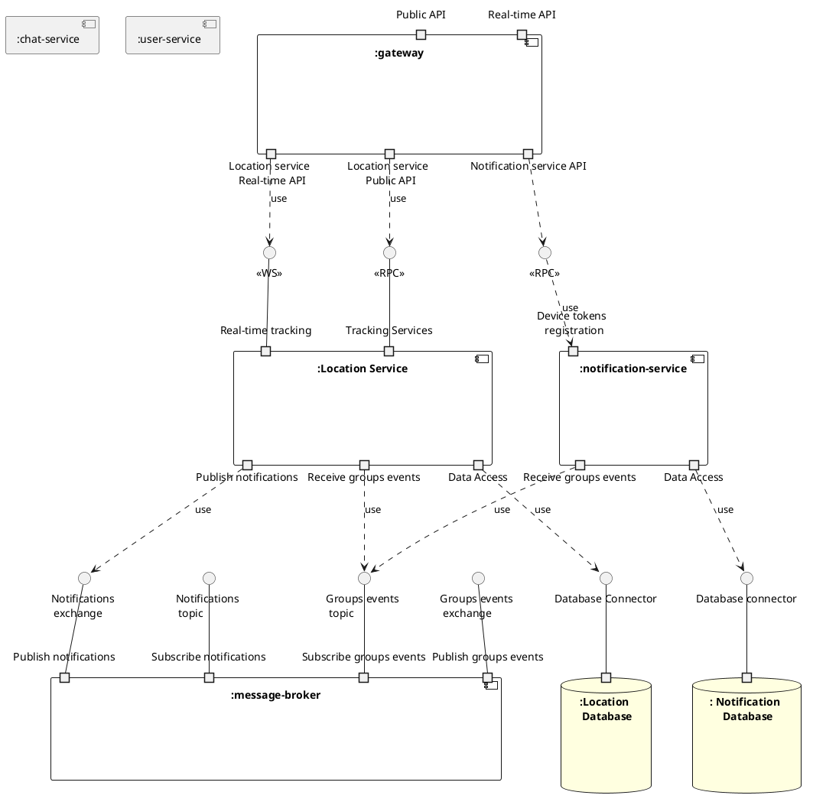

## C&C View

The following diagram shows the UML Component and Connector (C&C) view of the system, providing a high-level picture of the system's runtime entities in action and their boundaries.

```plantuml
@startuml architecture-cc
'=============================[ Styling ]============================'
skinparam component {
    BackgroundColor<<external>> White
    BackgroundColor<<executable>> #ccffcc
    BackgroundColor<<test>> cyan
}
skinparam DatabaseBackgroundColor LightYellow
skinparam NodeBackgroundColor White
'===========================[ Components ]==========================='
interface "Notifications \n exchange" as NOTIF_EXCH
interface "Groups events \n exchange" as GRPS_EXCH
interface "Notifications \n topic" as NOTIF_TOPIC
interface "Groups events \n topic" as GRPS_TOPIC
component ":message-broker" {
    portin "Publish groups events" as MB_PUB_GRPS
    portin "Publish notifications" as MB_PUB_NOTIF
    portin "Subscribe notifications" as MB_SUB_NOTIF
    portin "Subscribe groups events" as MB_SUB_GRPS
    NOTIF_EXCH -- MB_PUB_NOTIF
    GRPS_EXCH -- MB_PUB_GRPS
    NOTIF_TOPIC -- MB_SUB_NOTIF
    GRPS_TOPIC -- MB_SUB_GRPS
}

interface "<<WS>>" as GATEWAY_WS_LOC
interface "<<RPC>>" as GATEWAY_RPC_LOC
interface "<<RPC>>" as GATEWAY_RPC_NOT
component ":gateway" {
    portin "Public API" as GATEWAY_API
    portin "Real-time API" as GATEWAY_REALTIME
    portout "Location service \n Real-time API" as GATEWAY_LOC_REALTIME
    portout "Location service \n Public API" as GATEWAY_LOC_API
    GATEWAY_LOC_REALTIME ..> GATEWAY_WS_LOC : use
    GATEWAY_LOC_API ..> GATEWAY_RPC_LOC : use
    portout "Notification service API" as GATEWAY_NOT_API
    GATEWAY_NOT_API ..> GATEWAY_RPC_NOT
}
'------------------------[ Location Service ]-----------------------'
interface "Database Connector" as LOC_DB_CONN
component ":Location Service" {
    portin "Real-time tracking" as LOC_REALTIME
    portin "Tracking Services" as LOC_TRACK
    GATEWAY_WS_LOC -- LOC_REALTIME
    GATEWAY_RPC_LOC -- LOC_TRACK
    portout "Publish notifications" as LOC_PUB
    portout "Data Access" as LOC_DA
    portout "Receive groups events" as LOC_SUB
    LOC_DA ..> LOC_DB_CONN : use
    LOC_PUB ..> NOTIF_EXCH : use
    LOC_SUB ..> GRPS_TOPIC : use
}
database ":Location \n Database" as LOC_DB {
    portin " " as LOC_DB_DA
    LOC_DB_CONN -- LOC_DB_DA
}
'---------------------[ Notification Service ]---------------------'
interface "Database connector" as  NOT_DB_CONN
component ":notification-service" {
    portin "Device tokens \n registration" as NOT_API
    GATEWAY_RPC_NOT ..> NOT_API : use
    portout "Data Access" as NOT_DA
    portout "Receive groups events" as NOT_SUB
    NOT_DA ..> NOT_DB_CONN : use
    NOT_SUB ..> GRPS_TOPIC : use
}
database ": Notification \n Database" as  NOT_DB {
    portin " " as NOT_DB_DA
    NOT_DB_CONN -- NOT_DB_DA
}
'-------------------------[ Chat Service ]-------------------------'
component ":chat-service" {

}
'-------------------------[ User Service ]-------------------------'
component ":user-service" {

}
@enduml
```
