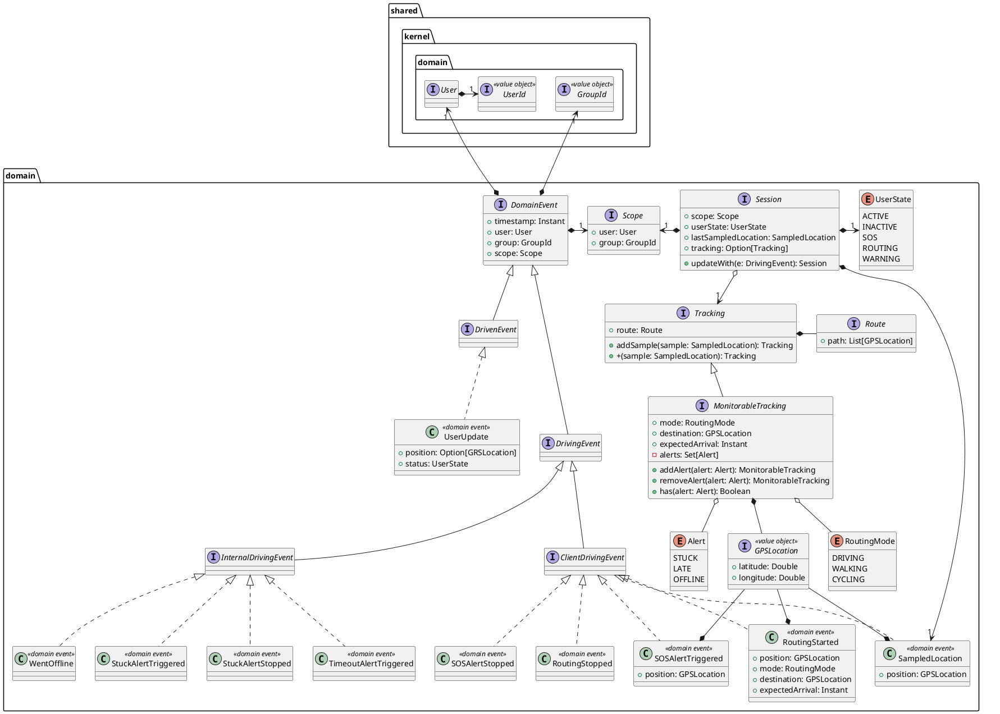
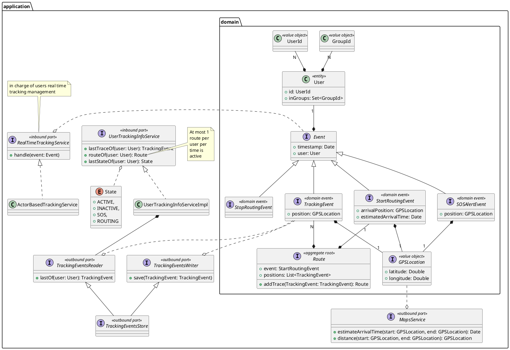
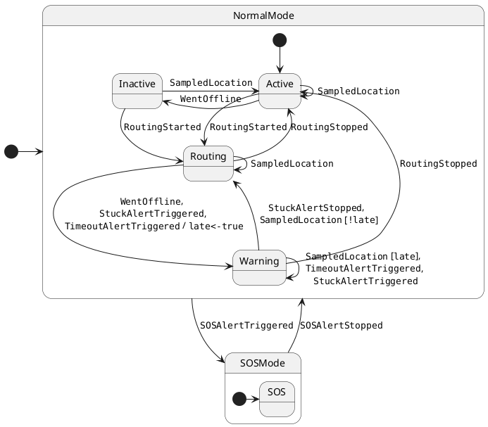
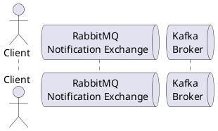
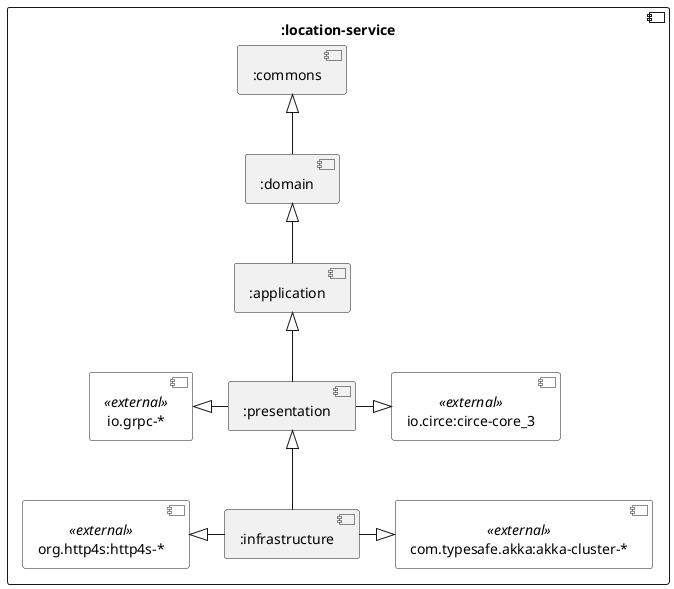

The location service is responsible for the real-time location tracking and management of the users tracking information.

## Abstract Design

### Main domain concepts (from knowledge crunching)

| Concept  | Description                                                                                                              | Synonyms |
| -------- | ------------------------------------------------------------------------------------------------------------------------ | -------- |
| Location | A specific point on a geographical plane, represented by coordinates that indicates where something / someone is located | Position |
| Route    | A set of positions that can be interpolated forming a path between two geographical positions                            | Path     |
| Tracking | Represent the user route information at a certain point in time                                                          |          |
| State    | State of a user at a certain time, the values that it could assume are: online, offline and SOS                          |          |

### Structure

The main domain concepts and events are presented hereafter and reified in the following classes structure, following the DDD principles.

- **`Scope`**: Represents the context in which an event occurs, it is composed of a user and a group, capturing the idea that a user's state can differ from group to group, enabling group-specific visibility and tracking.

<!--

-->

### Behavior

<!--
The active controller of the system is based on top of Akka actors which allows for a scalable and fault-tolerant system without arranging a complex infrastructure for it.
-->

<!--

### Interaction

-->

<!--
### Architectural Design

The project is structured by implementing hexagonal architecture, mapping layers to Gradle submodules.

-->
