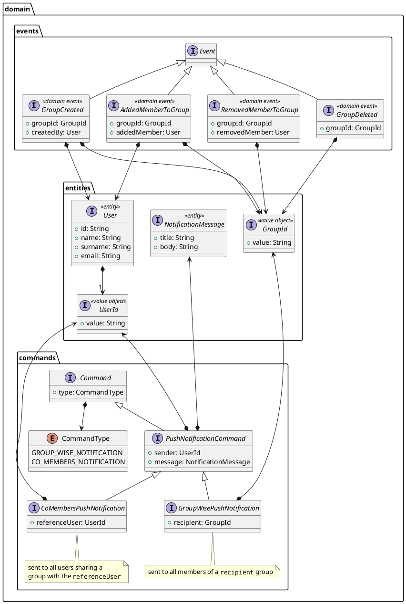

The shared kernel includes the common entities used by all services.
Its primary objective is to encapsulate _only_ the integration contracts and data structures meant to be passed across the boundaries of the bounded contexts.

Since the system's architecture is event-driven, communication between microservices occurs exclusively through events and commands exchanged via the message broker.
These events and commands have been represented as classes and interfaces, as illustrated in the following UML diagram.
This approach facilitates and reduce the cost of duplicating code across services, ensuring consistency and coherence in the system's communication.

- The `events` package contains all the events that can be triggered by the system, including group creation and removal, as well as the addition or removal of members from a group.
- The `commands` package contains all the commands that can be sent to the system. It includes the `PushNotificationCommand`, an abstract class representing a push notification command. This class has two concrete implementations:
  - `GroupWisePushNotification` - a command that sends a push notification to all members of a specific group.
  - `CoMembersPushNotification` - a command that sends a push notification to all users sharing a group with a specific user.
- Both commands and events rely on shared value objects and entities that represent the core concepts of the system, such as `UserId`, `GroupId`, `User`, and `NotificationMessage`. _**It is important to note that these entities contain only the attributes required to fulfill integration needs**. More complex design details are delegated to individual services, which are responsible for managing their own data and requirements and are free to evolve independently of other services._

