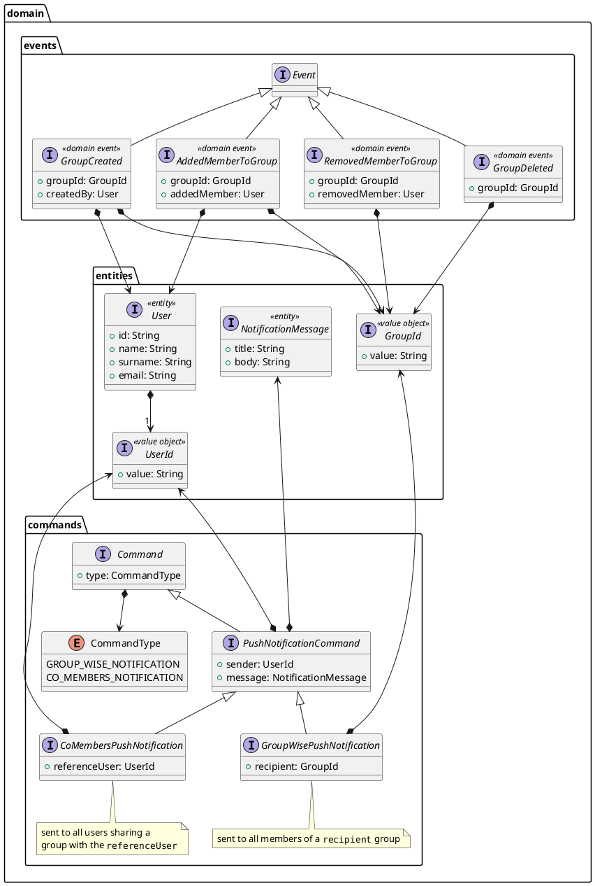

## Structure

```plantuml
@startuml shared-kernel-structure

package domain {

    package entities {
        interface GroupId <<value object>> {
            + value: String
        }

        interface UserId <<value object>> {
            + value: String
        }

        interface User <<entity>> {
            + id: String
            + name: String
            + surname: String
            + email: String
        }
        User *--> "1" UserId

        interface NotificationMessage <<entity>> {
            + title: String
            + body: String
        }
    }

    package events {
        interface Event

        interface AddedMemberToGroup <<domain event>> extends Event {
            + groupId: GroupId
            + addedMember: User
        }
        interface GroupCreated <<domain event>> extends Event {
            + groupId: GroupId
            + createdBy: User
        }
        interface GroupDeleted <<domain event>> extends Event {
            + groupId: GroupId
        }
        interface RemovedMemberToGroup <<domain event>> extends Event {
            + groupId: GroupId
            + removedMember: User
        }

        RemovedMemberToGroup *---> GroupId
        GroupDeleted *---> GroupId
        GroupCreated *---> GroupId
        GroupCreated *---> User
        AddedMemberToGroup *---> GroupId
        AddedMemberToGroup *---> User
    }

    package commands {
        interface Command {
            + type: CommandType
        }

        enum CommandType {
            GROUP_WISE_NOTIFICATION
            CO_MEMBERS_NOTIFICATION
        }
        Command *--> CommandType

        interface PushNotificationCommand extends Command {
            + sender: UserId
            + message: NotificationMessage
        }
        NotificationMessage <---* PushNotificationCommand

        interface GroupWisePushNotification extends PushNotificationCommand {
            + recipient: GroupId
        }
        note bottom of GroupWisePushNotification
            sent to all members of a ""recipient"" group
        end note

        interface CoMembersPushNotification extends PushNotificationCommand {
            + referenceUser: UserId
        }
        note bottom of CoMembersPushNotification
            sent to all users sharing a
            group with the ""referenceUser""
        end note

        PushNotificationCommand *-up--> UserId
        GroupWisePushNotification *-up-> GroupId
        CoMembersPushNotification *-up-> UserId
    }
}

@enduml
```
