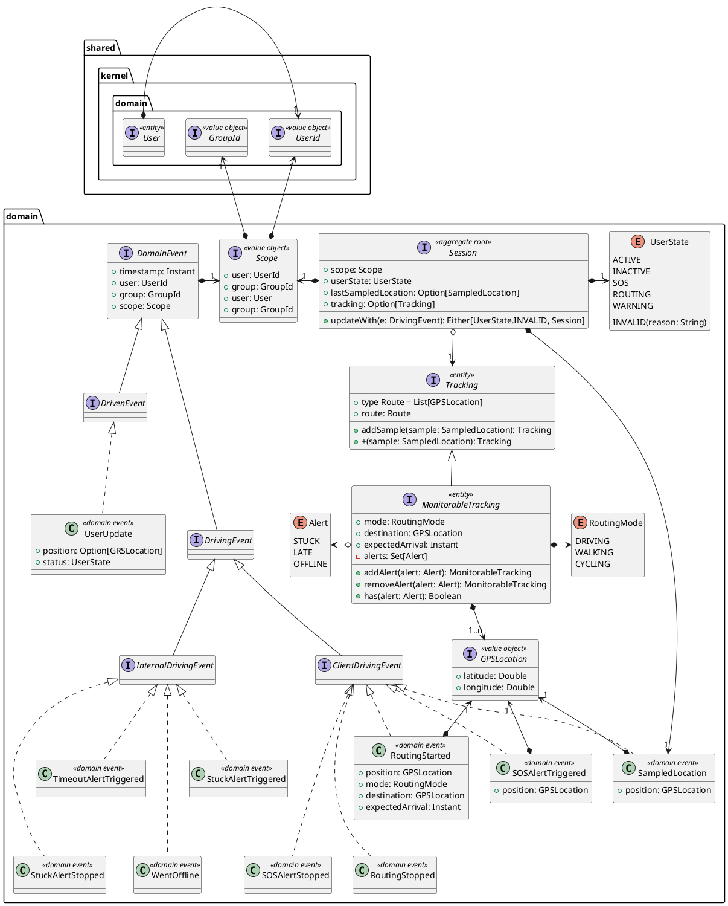
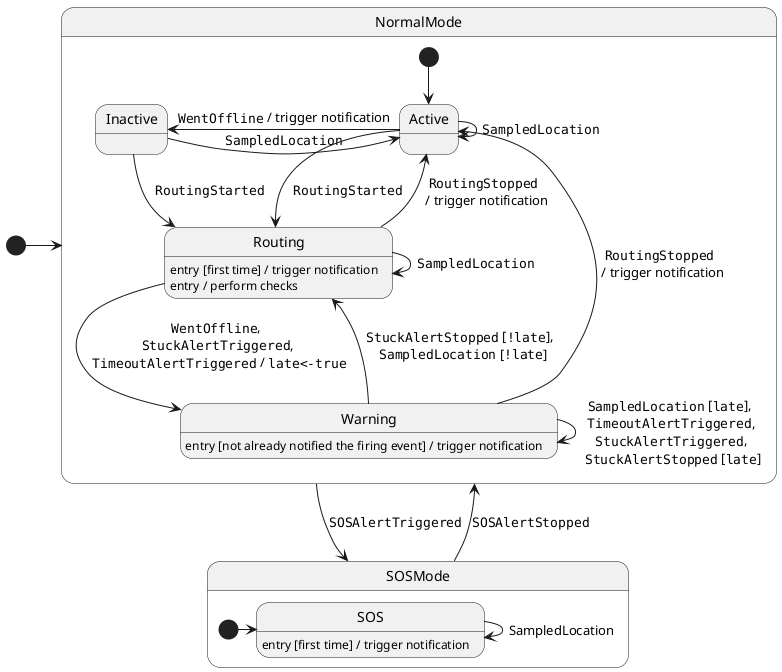
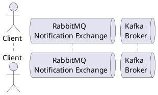
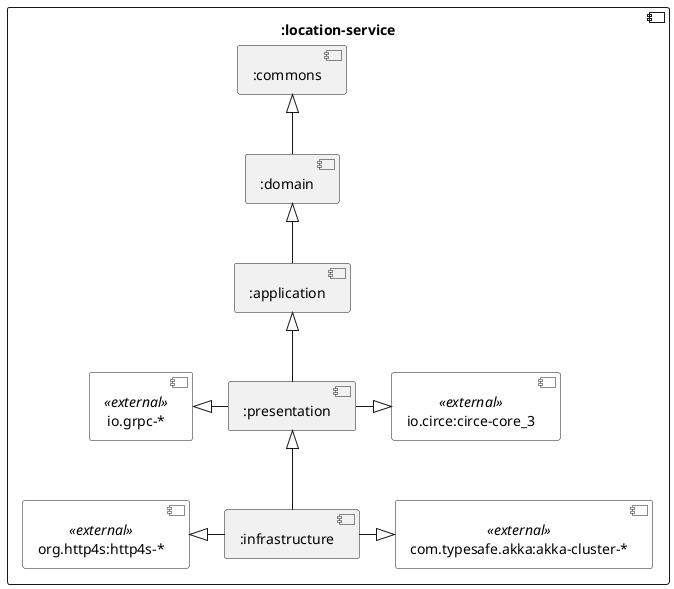

The location service is responsible for the **real-time location _tracking_** and **management** of the **_users tracking information_**.

This chapter explains the strategies used to meet the requirements identified in the analysis.

The design is based on the **Domain-Driven Design** principles, focusing on the _structure_, _behavior_, and _interaction_ of the system.

## Abstract Design

<!--

### Main domain concepts (from knowledge crunching)

| Concept  | Description                                                                                                              | Synonyms |
| -------- | ------------------------------------------------------------------------------------------------------------------------ | -------- |
| Location | A specific point on a geographical plane, represented by coordinates that indicates where something / someone is located | Position |
| Route    | A set of positions that can be interpolated forming a path between two geographical positions                            | Path     |
| Tracking | Represent the user route information at a certain point in time                                                          |          |
| State    | State of a user at a certain time, the values that it could assume are: online, offline and SOS                          |          |

-->

### Structure

The main domain concepts and events are presented hereafter and reified in the following classes structure, following the DDD building blocks.

- **`Scope`**: A _value object_ representing the context in which an event occurs. It is composed of a user and a group, capturing the idea that a user's state can differ from group to group, enabling group-specific visibility and tracking.
- **`Tracking`**: An _entity_ representing the user's route information at a certain point in time, it is composed of a list of positions that can be interpolated to form a path between two geographical positions.
  - **`MonitorableTracking`**: a specialized `Tracking` _entity_ that includes the mode of transportation, the destination, the expected arrival time, enabling the system to monitor the user's route and trigger alerts when necessary.
- **`Session`**: An _aggregate root entity_ storing the overall state of a user in a group at a certain point in time. It acts as a state machine, updating the state and the tracking information based on the received events, ensuring the consistency of the user's state is maintained.
- **`DomainEvent`**: An _interface_ representing the base structure of a domain event, capturing the timestamp, the user, and the group in which the event occurs. It is the base type for all the events that occur in the system.
  - **`DrivingEvent`**: An _interface_ representing the base structure of a driving event, i.e. a valuable event guiding an application use case.
    - **`ClientDrivingEvent`**: A specialized `DrivingEvent` _interface_ representing the events that are triggered by the user's actions, such as sampling the location, triggering an SOS alert, starting or stopping a routing.
    - **`InternalDrivingEvent`**: A specialized `DrivingEvent` _interface_ representing the events that are triggered by the system, such as the user going offline, triggering a stuck alert, or a timeout alert.
  - **`DrivenEvent`**: An _interface_ representing the base structure of a driven event, i.e. an event triggered by the system as a result of some system state change / action.

```plantuml
@startuml location-service-infrastructure
package application {

    interface UserGroupsReader {
        + groupsOf(user: UserId): Set[GroupId]
        + membersOf(group: GroupId): Set[UserId]
    }
    interface UserGroupsWriter {
        + addMemberk(groupId: GroupId, userId: UserId)
        + removeMember(groupId: GroupId, userId: UserId)
    }
    interface UserGroupsStore <<repository>> <<out port>> extends UserGroupsReader, UserGroupsWriter 

    interface UserGroupsService <<service>> {
        + addedMember(event: AddedMemberToGroup)
        + removeMember(event: RemovedMemberFromGroup)
        + groupsOf(userId: UserId): Set[GroupId]
        + membersOf(groupId: GroupId): Set[UserId]
    }

    '----------------------------------------------------'

    interface NotificationService <<service>> {
        + sendToOwnGroup(scope: Scope, message: NotificationMessage)
        + sendToGroup(recipient: GroupId, sender: UserId, message: NotificationMessage)
        + sendToAllMembersSharingGroupWith(user: UserId, sender: UserId, message: NotificationMessage)
    }

    interface UserSessionReader 
    interface UserSessionWriter
    interface UserSessionStore <<repository>> <<out port>> extends UserSessionReader, UserSessionWriter

    interface UsersSessionService <<service>> {
    }

    interface MapsService <<service>> {
    }

    interface RealTimeTracking <<service>> {
    }

}
@enduml
```

### Behavior

<!--
The active controller of the system is based on top of Akka actors which allows for a scalable and fault-tolerant system without arranging a complex infrastructure for it.
-->

As an event driven architecture, the state of each group's member can be described by the following state diagram, drawing the possible state transitions that can be fired by one of the above `DrivingEvent`.

<!--

### Interaction

-->

<!--
### Architectural Design

The project is structured by implementing hexagonal architecture, mapping layers to Gradle submodules.

-->
