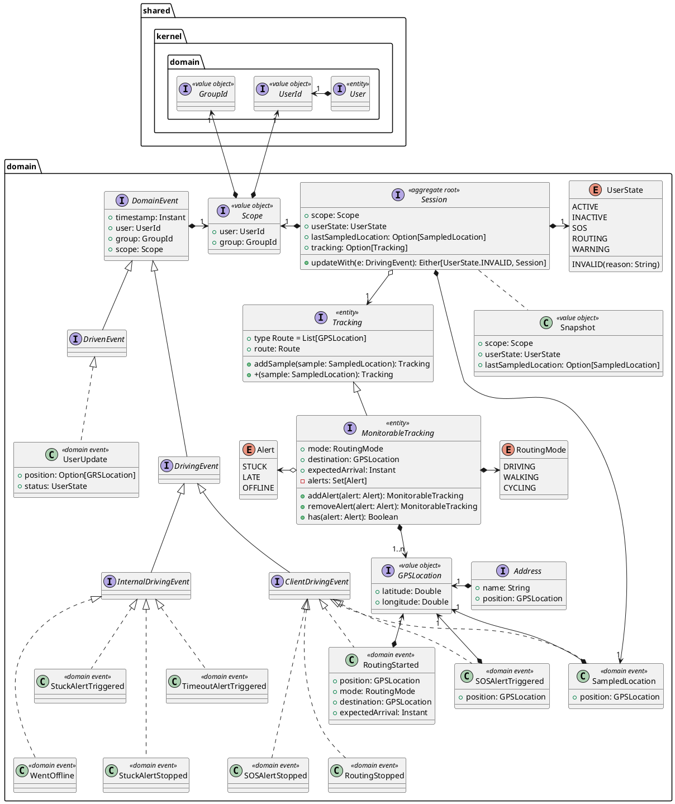
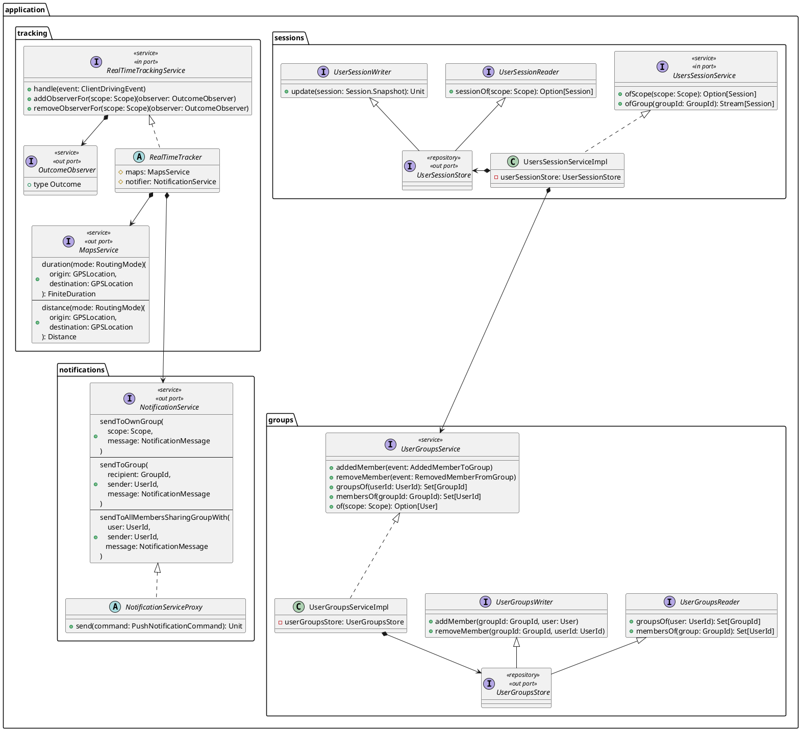
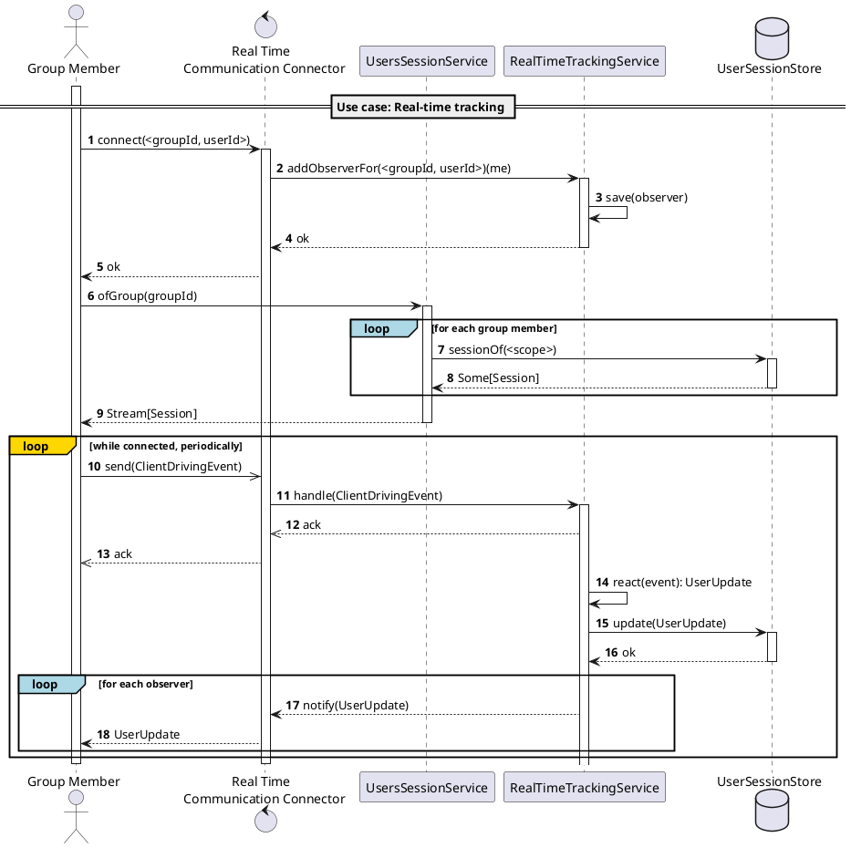
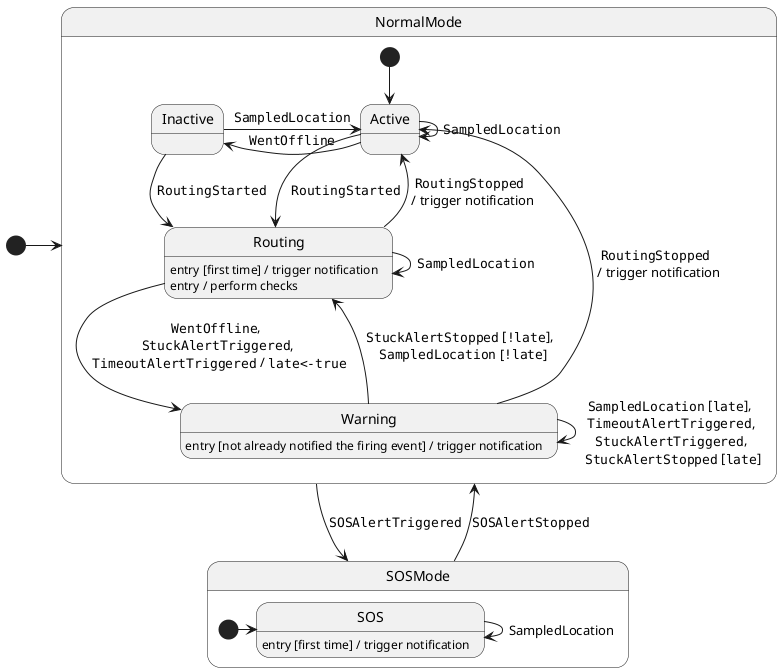

<!--This chapter explains the strategies used to meet the requirements identified in the analysis.-->

In this section it is presented the abstract design of the **Location Service**.
As per best practices, the design is based on the **Domain-Driven Design** principles, and is presented in terms of the main three views: **structure**, **interaction**, and **behavior**.

## Abstract Design

### Structure

The main domain concepts and events are presented hereafter and reified in the following classes structure, following the DDD building blocks.

- **`Scope`**: A _value object_ representing the context in which an event occurs. It is composed of a user and a group, capturing the idea that a user's state can differ from group to group, enabling group-specific visibility and tracking.
- **`Tracking`**: An _entity_ representing the user's route information at a certain point in time, it is composed of a list of positions that can be interpolated to form a path between two geographical positions.
  - **`MonitorableTracking`**: a specialized `Tracking` _entity_ that includes the mode of transportation, the destination, the expected arrival time, enabling the system to monitor the user's route and trigger alerts when necessary.
- **`Session`**: An _aggregate root entity_ storing the overall state of a user in a group at a certain point in time. It acts as a state machine, updating the state and the tracking information based on the received events, ensuring the consistency of the user's state is maintained.
  - A **`Snapshot`** is a _value object_ capturing a snapshot of the user's state.
- **`DomainEvent`**: An _interface_ representing the base structure of a domain event, capturing the timestamp, the user, and the group in which the event occurs. It is the base type for all the events that occur in the system.
  - **`DrivingEvent`**: An _interface_ representing the base structure of a driving event, i.e. a valuable event guiding an application use case.
    - **`ClientDrivingEvent`**: A specialized `DrivingEvent` _interface_ representing the events that are triggered by the user's actions, such as sampling the location, triggering an SOS alert, starting or stopping a routing.
    - **`InternalDrivingEvent`**: A specialized `DrivingEvent` _interface_ representing the events that are triggered by the system, such as the user going offline, triggering a stuck alert, or a timeout alert.
  - **`DrivenEvent`**: An _interface_ representing the base structure of a driven event, i.e. an event triggered by the system as a result of some system state change / action.

The application services and repositories are presented in the following diagram, which presents only the main interfaces, leaving out the implementation and the adapters classes.

- `MapsService`: the service responsible for calculating the distance and the duration between two geographical positions, based on the mode of transportation.
- `NotificationService`: the service responsible for sending notifications, acting as a _proxy_ towards the notification service. The concrete adapter is in charge of sending the notification to the appropriate channel of the message broker.
- `RealTimeTracking`: the service responsible for handling the driving events, acting as an input port for the external adapters. It allows to register observers to be get back real-time updates.
- Clients can in any moment get a snapshot of the user's state and location by querying the `UsersSessionService` service, which is responsible for managing the user's session state.
  - The actual tracking information are stored through the `UserSessionStore` repository, which is responsible for the persistence of the user's session state. A `UserSessionStore` is both a `Writer` and a `Reader` for the `Session` entity. Separate write-side and read-side interfaces are defined to ensure the separation of concerns and the single responsibility principle, leaving the implementation open to adhere to CQRS pattern.
- `UserGroupsService` is responsible for managing the saving and retrieval of the groups members through the `UserGroupsStore` repository. Updates happen thanks the events propagated by the User service.

### Interaction

The interaction between the main components of the system is described in the following sequence diagram.

The Group Member connects to the `RealTimeTracking` service through a `Real Time Communication Connector` starting observing the updates of the group members it belongs to.
However, before starting reacting to these updates, it fetches the current state of all group members through the `UsersSessionService` service, ensuring a consistent view of their state.
Once the current state of all members is obtained, it starts reacting to the updates of other groups members while sending its own updates to the service.
The `RealTimeTracking` service, upon receiving the updates, reacts to the events and updates the user's session state, sending back the result to all the group members currently observing group's changes.

Please, note the diagram illustrates only the main success flow, leaving out the error handling and the edge cases.

### Behavior

As an event driven architecture, the state of each group's member can be described by the following state diagram, drawing the possible state transitions that can be fired by one of the above `DrivingEvent`.

