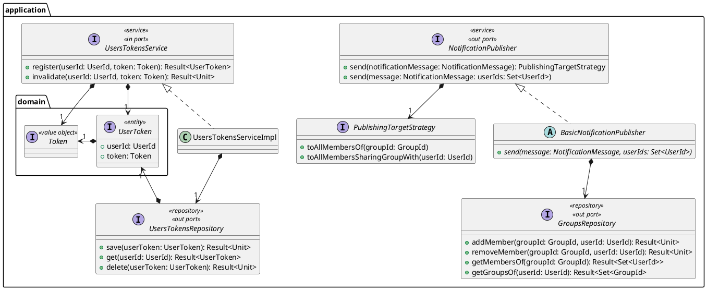

## Structure

```plantuml
@startuml notification-service-structure

package application {

    package domain {

        interface Token <<value object>> {}

        interface UserToken <<entity>> {
            + userId: UserId
            + token: Token
        }
        UserToken *-left-> "1" Token
    }

    interface GroupsRepository <<repository>> <<out port>> {
        + addMember(groupId: GroupId, userId: UserId): Result<Unit>
        + removeMember(groupId: GroupId, userId: UserId): Result<Unit>
        + getMembersOf(groupId: GroupId): Result<Set<UserId>>
        + getGroupsOf(userId: UserId): Result<Set<GroupId>
    }

    interface NotificationPublisher <<service>> <<out port>> {
        + send(notificationMessage: NotificationMessage): PublishingTargetStrategy
        + send(message: NotificationMessage: userIds: Set<UserId>)
    }

    interface PublishingTargetStrategy {
        + toAllMembersOf(groupId: GroupId)
        + toAllMembersSharingGroupWith(userId: UserId)
    }

    NotificationPublisher *--> "1" PublishingTargetStrategy

    abstract class BasicNotificationPublisher implements NotificationPublisher {
        + {abstract} send(message: NotificationMessage, userIds: Set<UserId>)
    }
    BasicNotificationPublisher *--> "1" GroupsRepository

    interface UsersTokensRepository <<repository>> <<out port>> {
        + save(userToken: UserToken): Result<Unit>
        + get(userId: UserId): Result<UserToken>
        + delete(userToken: UserToken): Result<Unit>
    }

    interface UsersTokensService <<service>> <<in port>> {
        + register(userId: UserId, token: Token): Result<UserToken>
        + invalidate(userId: UserId, token: Token): Result<Unit>
    }

    UsersTokensRepository *-left--> "1" UserToken
    UsersTokensService *--> "1" UserToken
    UsersTokensService *--> "1" Token

    class UsersTokensServiceImpl implements UsersTokensService
    UsersTokensServiceImpl *--> "1" UsersTokensRepository
    

}
@enduml
```
