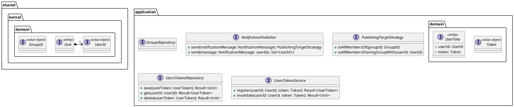

## Structure

```plantuml
@startuml notification-service-structure

package shared.kernel.domain {
    interface User <<entity>>
    interface UserId <<value object>>
    interface GroupId <<value object>>
    User *-r-> "1" UserId
}

package application {

    package domain {

        interface Token <<value object>> {}

        interface UserToke <<entity>> {
            + userId: UserId
            + token: Token
        }
    }

    interface GroupsRepository

    interface NotificationPublisher {
        + send(notificationMessage: NotificationMessage): PublishingTargetStrategy
        + send(message: NotificationMessage: userIds: Set<UserId>)
    }

    interface PublishingTargetStrategy {
        + toAllMembersOf(groupId: GroupId)
        + toAllMembersSharingGroupWith(userId: UserId)
    }

    interface UsersTokensRepository {
        + save(userToken: UserToken): Result<Unit>
        + get(userId: UserId): Result<UserToken>
        + delete(userToken: UserToken): Result<Unit>
    }

    interface UsersTokensService {
        + register(userId: UserId, token: Token): Result<UserToken>
        + invalidate(userId: UserId, token: Token): Result<Unit>
    }

}
@enduml
```
