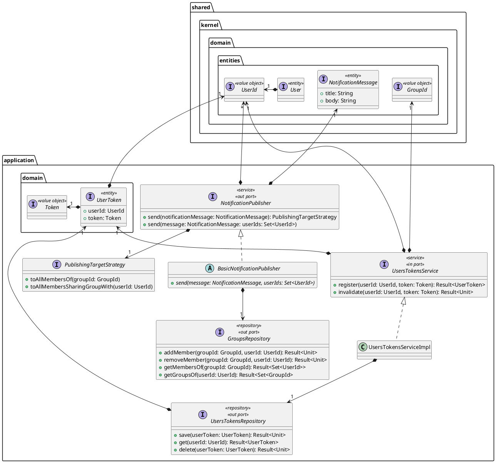
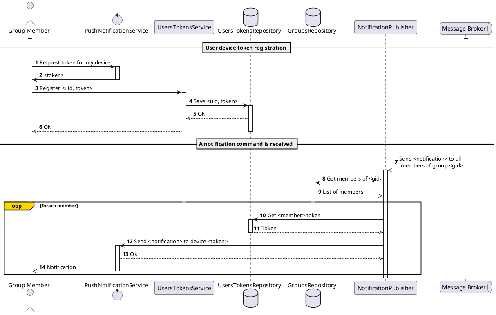

In this section is presented the abstract design of the notification service.

As already presented, its main responsibility is to **send notifications** to the users, based on the events that occur in the system.

## Structure

The structure of the service is quite simple:

- `Token` is a value object that represents the token used to identify the device of a user.
- `UserToken` is an entity that represents the association between a user and a token.
- `UsersTokensService` is the service that allows registering and invalidating tokens for users.
- `UsersTokensRepository` is the repository that stores the associations between users and tokens.
- `NotificationPublisher` is the service that sends notifications to users.
  - `PublishingTargetStrategy` is the strategy used to determine the target of the notification. Two stategies exists: one to send to all members of a group (corresponding to the `GroupWisePushNotification` command) and another to send to all members sharing a group with a user (corresponding to the `CoMembersPushNotification` command).
- `GroupsRepository` is the repository that allows storing and retrieving the members of the groups. This is called by the message broker adapter on every events whose topic is related to groups state changes.

## Interaction

The main flow scenario is depicted in the following sequence diagram:

