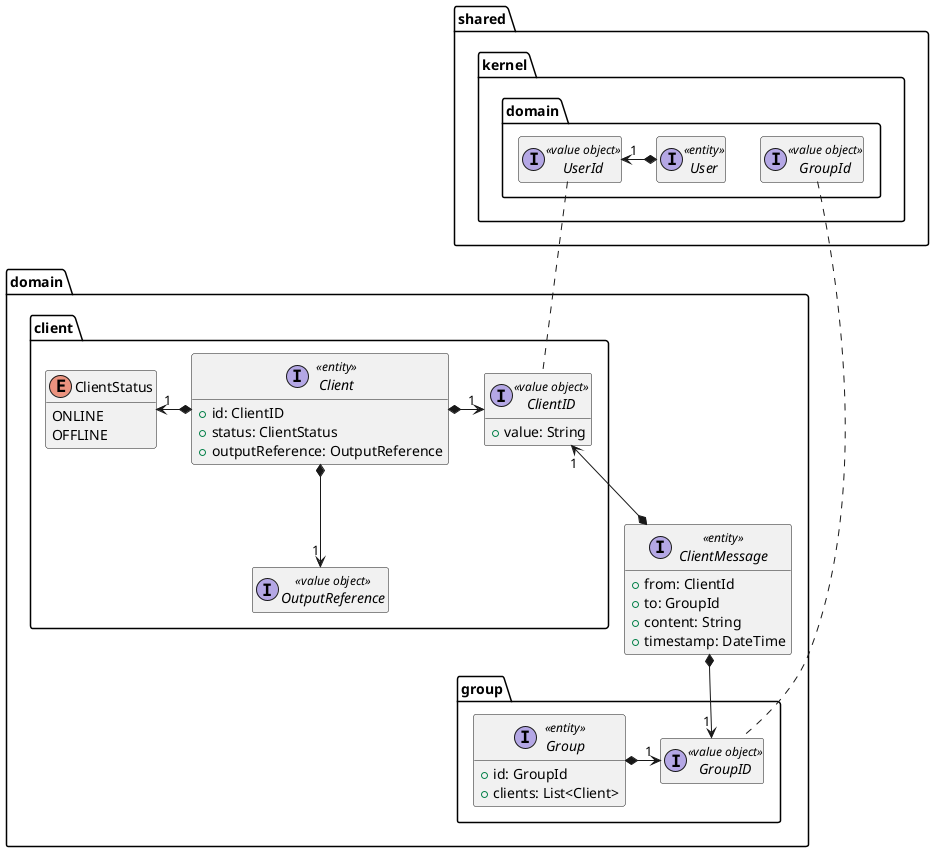
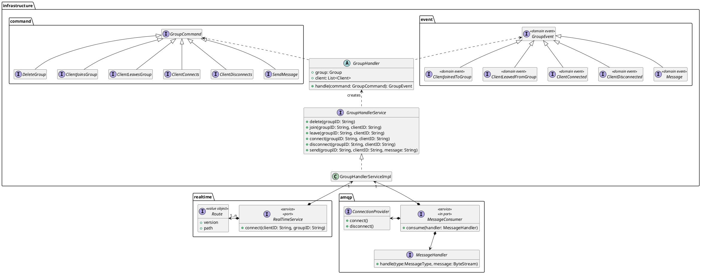
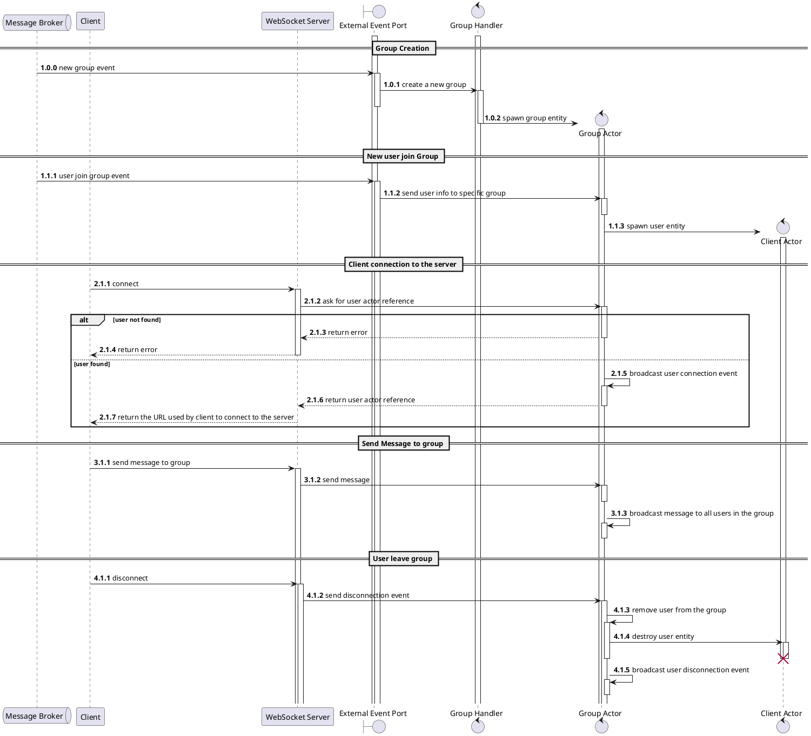

Chat service is responsible for managing the **communication between users in _real-time_**. This document describes the detailed design of the chat service, including its architecture, components, and interactions.

## Abstract Design

Here are presented the main components of the chat service, we start describing the foundamental entities of the domain, then we move to the infrastructure layer, where we define the commands and events that will be used to interact with the domain entities.

### Structure

- **Client**: An entity that represents a user connected to the chat service. It has an identifier, a status, and a reference to the output channel.
  - **ClientID**: A value object that represents the unique identifier of a client that connects to the chat service. This is a 1-1 mapping to the user identifier used in the shared kernel.
  
  - **OutputReference**: A value object that represents the reference to the output channel of a client. This reference is used to send messages to the client.
- **Group**: An entity that represents a group of clients that can communicate with each other. It has an identifier and a list of clients.
  - **GroupID**: A value object that represents the identifier of a group. This is a 1-1 mapping to the group identifier used in the shared kernel.
- **ClientMessage**: An entity that represents a message sent by a client to a group. It contains the sender, the group, the content, and the timestamp of the message.

In the following diagram are presented the main services interfaces that will be used to interact with the domain entities and to respond to the external events.

### Interaction between Entities

Finally, we present the interaction between the main components of the chat service. The following diagram shows the sequence of main events that occours inside the chat service.

