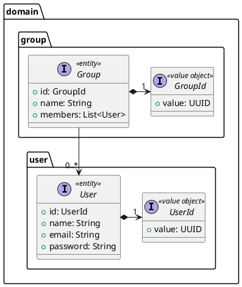
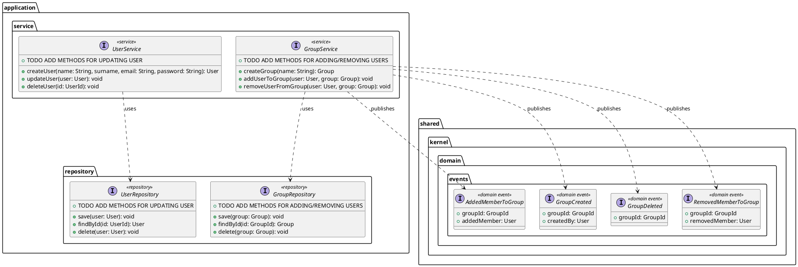
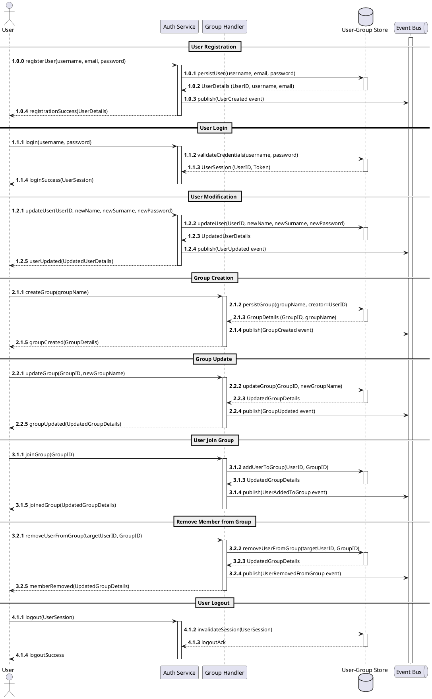

In this section it is presented the abstract design of the **User and Group Service**.
As per best practices, the design is based on the **Domain-Driven Design** principles, and is presented in terms of the main three views: **structure**, **interaction**, and **behavior**.

## Abstract Design

### Structure

The main domain concepts and events are presented hereafter and reified in the following classes structure, following the DDD building blocks.

- **`User`**: The User entity represents an individual in the system. Each User is uniquely identified by a value object, _UserId_, ensuring consistency and traceability. The entity includes attributes such as name, email, and password, which can be updated while maintaining the same identity.

- **`Group`** The Group entity represents a collection of users. It is identified by a _GroupId_ value object and has attributes like a group name and a list of members (Users). The association (Group → 0..* User) signifies that a group can have zero or more users, enabling flexible management of group memberships.

- **`User-Group Context:`** Although not explicitly modeled as a value object in the diagram, the context in which events occur is defined by the association between a user and a group. This context is crucial for tracking state variations that might be specific to a group—allowing, for example, group-specific permissions or visibility settings.

- **`Domain Events:`** Domain events capture significant changes within the business context and play a key role in maintaining consistency and notifying other system components. All events implement the DomainEvent interface, ensuring a common structure (for instance, including a timestamp and references to the affected user and group). Key events include:

  - **`UserCreated:`**
Triggered when a new user is created. It contains the UserId, name, and email, enabling other components (such as notification services) to react accordingly.

  - **`GroupCreated:`**
Signals the creation of a new group, carrying the _GroupId_ and group name to initiate processes like automatic configuration or internal notifications.

  - **`UserAddedToGroup:`**
Captures the event of adding a user to a specific group by linking the _UserId_ and _GroupId_.

  - **`UserRemovedFromGroup:`**
Records the removal of a user from a group, including both _UserId_ and _GroupId_.

- **`Repositories:`**

  - **`UserRepository:`** Abstracts the persistence operations for User entities by exposing methods such as save(user: User), findById(id: UserId): User, and delete(user: User).

  - **`GroupRepository:`** Similarly abstracts persistence for Group entities with equivalent operations.

- **`Services:`**

  - **`UserService:`** Contains business logic for creating, updating, and deleting users. It leverages the UserRepository for data operations and publishes a UserCreated event when a new user is created.

  - **`GroupService:`** Manages group-related operations such as creating groups, adding users to groups, and removing users from groups. It uses the GroupRepository for data access and publishes GroupCreated, UserAddedToGroup, and UserRemovedFromGroup events as necessary.

  // TODO CHECK EVENTS

### Interaction
The interaction between the main components of the system is described in the following sequence diagram.

- `User Registration:` A new user registers by sending their username, email, and password to the Auth Service. The service persists the new user in the User-Group Store, publishes a UserCreated event on the Event Bus, and returns the created user details.

- `User Login:` The user logs in by providing credentials. The Auth Service validates these against the User-Group Store and returns a UserSession (including a token).

- `User Modification:` The user modifies their own details (e.g., changing name, surname or password) by sending an update request to the Auth Service. The service updates the record, publishes a UserUpdated event, and returns the updated user information.

- `Group Creation:` The user creates a group through the Group Handler. The handler persists the new group (recording the creator’s UserID), publishes a GroupCreated event, and returns the group details.

- `Group Update:` The user updates the group’s name via the Group Handler. The updated details are persisted, a GroupUpdated event is published, and the updated group details are returned.

- `User Join Group:` The user joins a group by sending a join request to the Group Handler. The Group Handler adds the user to the group in the store, publishes a UserAddedToGroup event, and returns the updated group details.

- `Remove Member from Group:` The user (or possibly a group owner) removes a target member from the group by sending a removal request. The Group Handler updates the membership in the store, publishes a UserRemovedFromGroup event, and returns the updated group details.

- `User Logout:` The user logs out by sending a logout request to the Auth Service. The service invalidates the session in the store and returns a logout acknowledgment.

Please, note the diagram illustrates only the main success flow, leaving out the error handling and the edge cases.

