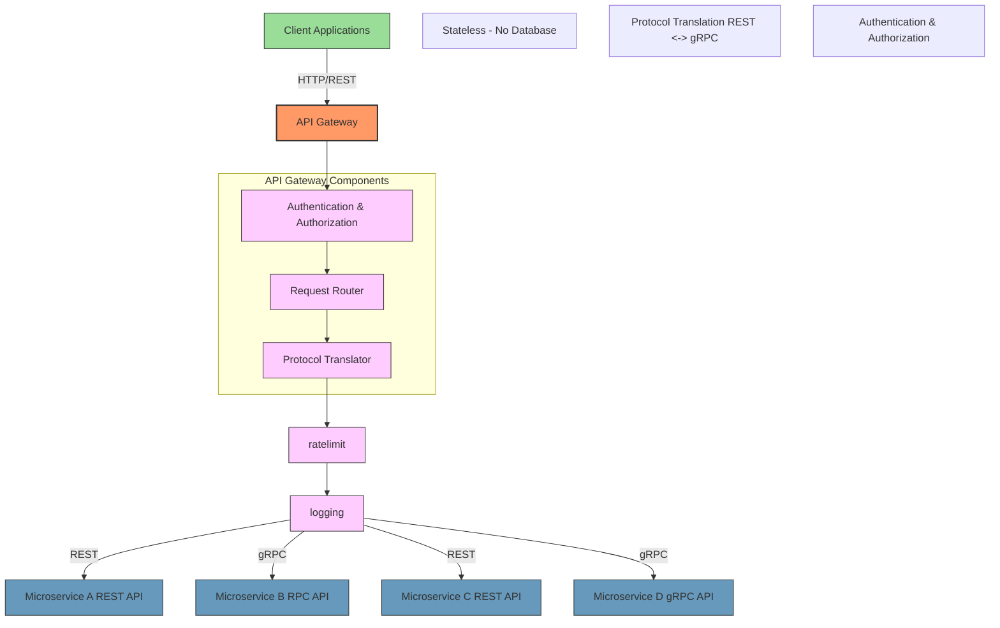

## Message Broker and RPC technologies

Why RabbitMQ?
Why gRPC?

**
tecnologie
tipologia
**
TODO - GIOVA

## Gateway

The gateway is the entry point of the system and is the only service that is exposed to the outside world.
Their main responsibilities and features are:

- **routing each request to the correct service after having authenticated and authorized the user**: it is important that only authenticated users can access the services and that they can only access the functionalities they are allowed to use. For example, a user can only access the functionalities of the group they belong to.
- **protocol translation**: for _synchronous_ remote procedure calls it is a best practice to use a ReST based API over the chosen gRPC protocol. This is because ReST APIs can be easily consumed by any client since they leverage standard HTTP methods and formats (like JSON), while gRPC APIs are more efficient but require specialized client libraries to handle Protobuf messages and HTTP/2 connections.
- since it is the entry-point of the system it can be a single point of failure and a bottleneck. To avoid this it is implemented like a **stateless service**, so it can be easily scaled horizontally to handle more requests and to be fault-tolerant.

The gateway is implemented in Javascript leveraging the Express framework.

**
tecnologie
middleware
express
cucumber
**
TODO - LUCA

## Shared Kernel
**
tecnologie
codice
**
TODO - VALE
