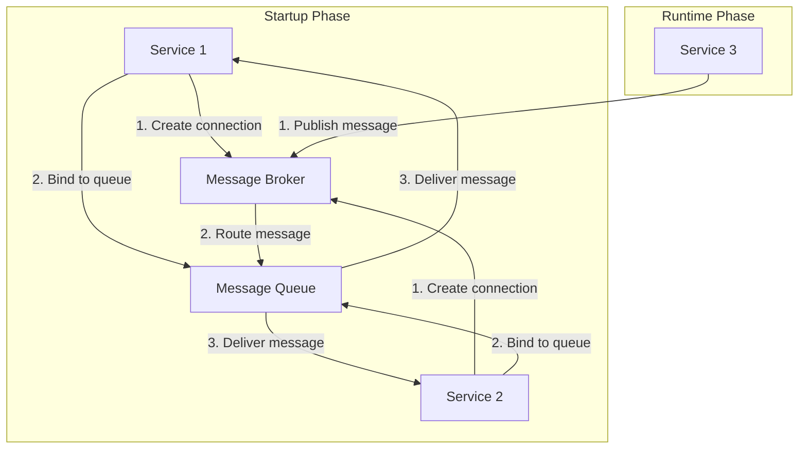

## Message Broker and RPC technologies
Position Pal's event-based distributed system architecture relies on both synchronous and asynchronous communication between services. For asynchronous interactions, we use a message broker that decouples services and enables event-driven architectures, this handles message routing between services and ensures reliable event delivery. When synchronous communication is required we utilize Remote Procedure Call (RPC) technologies, allowing services to invoke each other's methods as if they were local functions—an approach particularly effective for request-response interactions between services.

### Message Broker
The technology used for the message broker is [RabbitMQ](https://www.rabbitmq.com/) which is a widely adopted open-source message broker that supports multiple messaging protocols, including Advanced Message Queuing Protocol (AMQP) and Message Queuing Telemetry Transport (MQTT). RabbitMQ provides features such as message queuing, routing, and delivery guarantees, making it suitable for building scalable and reliable distributed systems.
The main responsibilities and features are:

- **Message Queuing**: RabbitMQ allows services to send messages to queues, which can be consumed by other services asynchronously. This decouples the sender and receiver, enabling services to communicate without being directly connected.
- **Message Routing**: RabbitMQ supports message routing based on message attributes and routing keys, allowing messages to be selectively delivered to specific queues or exchanges.

At startup each service that is interested in receiving messages from a specific queue will create a connection to the message broker and bind to the queue. When a message is published to that queue, the broker will deliver it to all bound consumers. This pattern allows services to communicate in a loosely coupled manner, enabling scalability and fault tolerance. 



### RPC Technologies
For synchronous communication between services, we use [gRPC](https://grpc.io/), a high-performance, open-source RPC framework developed by Google. gRPC uses Protocol Buffers (Protobuf) as its interface definition language and provides features such as bi-directional streaming, authentication, and load balancing. gRPC is particularly well-suited for microservices architectures due to its efficiency and support for multiple programming languages.

Every service that exposes an API will define its interface using Protobuf and generate client and server code in the desired programming language. This allows services to communicate over HTTP/2 using binary serialization, which is more efficient than text-based formats like JSON. gRPC also supports streaming and bidirectional communication, making it suitable for a wide range of use cases.

## Gateway

The gateway is the entry point of the system and is the only service that is exposed to the outside world.
Their main responsibilities and features are:

- **routing each request to the correct service after having authenticated and authorized the user**: it is important that only authenticated users can access the services and that they can only access the functionalities they are allowed to use. For example, a user can only access the functionalities of the group they belong to.
- **protocol translation**: for _synchronous_ remote procedure calls it is a best practice to use a ReST based API over the chosen gRPC protocol. This is because ReST APIs can be easily consumed by any client since they leverage standard HTTP methods and formats (like JSON), while gRPC APIs are more efficient but require specialized client libraries to handle Protobuf messages and HTTP/2 connections.
- since it is the entry-point of the system it can be a single point of failure and a bottleneck. To avoid this it is implemented like a **stateless service**, so it can be easily scaled horizontally to handle more requests and to be fault-tolerant.


The API Gateway is implemented using **Express**, a lightweight and flexible _Node.js_ framework that simplifies the creation of web applications and ReST APIs.

An express application is built around the concept of _routes_ and _controllers_: routes define the API endpoints and delegate request processing, while controllers contain the logic for handling requests, such as forwarding them to microservices or aggregating responses.

An example of a route to get all the [groups sessions]():

```javascript
const express = require("express");
const router = express.Router();
const sessionController = require("../controllers/session.controller");
const { groupAuthMiddleware } = require("../middlewares/groupAuth.middleware");

// Before calling the controller, the groupAuthMiddleware is executed 
// to check if the user is authorized to access the group (see below)
router.get("/session/:group", groupAuthMiddleware, sessionController.getCurrentSession);
```

and the corresponding controller acting as a proxy to the location service, in charge of protocol translation from gRPC to HTTP:

```javascript
const sessionClient = require("../grpc/clients/sessionClient"); // gRPC client

exports.getCurrentSession = (req, res, next) => {
  const groupId = req.params.group;
  if (!groupId) {
    return next(new HttpBaseError(HTTP_STATUS.BAD_REQUEST, "Bad request", "Group ID is required"));
  }
  let sessions = [];
  // Actual gRPC call to the location service that returns a lazy stream of sessions for the 
  // given group ID. This is converted to a json array and sent back to the client as a response.
  sessionClient.getCurrentSession(
    { value: groupId },
    (response) => { /* on data callback */
      const code = getHttpStatusCode(response.status.code);
      if (code !== HTTP_STATUS.OK) {
        return next();
      }
      sessions.push(response.session);
    },
    () => { /* on stream end callback */
      res.locals.status = { code: "OK" };
      res.locals.data = { sessions };
      return next();
    },
    (error) => next( /* on error callback */
      new HttpBaseError(HTTP_STATUS.GENERIC_ERROR, "Internal server error", `gRPC Error: ${error}`)
    ),
  );
};
```

In this scenario, middleware plays a crucial role in the request-response lifecycle.
Middleware functions in Express are used to process incoming requests before they reach the core business logic (the _controller_ handler) and to handle responses before they are sent back to the client.
This modular approach helps organize the application logic into smaller, reusable components that can be stacked and composed as needed.

Indeed, the steps presented in the schema above (i.e. authentication, authorization, protocol and response translation) are implemented as middleware functions in the API Gateway.

For example, the middleware function that performs authorization based on the user's group membership can be seen below:

```javascript
async function groupAuthMiddleware(req, res, next) {
  const token = req.headers.authorization || "";
  const group = req.params.group || "";
  if (!token || !group) {
    return next(
      new HttpBaseError(HTTP_STATUS.BAD_REQUEST, "Bad Request", "Token and groupId are required")
    );
  }
  try {
    const authorized = await authGroup(token.trim(), group.trim());
    if (authorized) {
      return next();
    } else {
      return next(
        new HttpBaseError(HTTP_STATUS.UNAUTHORIZED, "Unauthorized", "Unauthorized access to group")
      );
    }
  } catch (error) {
    return next(
      new HttpBaseError(HTTP_STATUS.GENERIC_ERROR, "Internal server error", `gRPC Error: ${error}`)
    );
  }
}

function authGroup(token, groupId) {
  return new Promise((resolve) => {
    authorizeUserToAccessGroup({ token, groupId }, (err, response) => {
      if (err) {
        return resolve(false);
      }
      resolve(response?.authorized || false);
    });
  });
}
```

Note that the ReST API Gateway is implemented using the [Level 2 of the Richardson Maturity Model](https://martinfowler.com/articles/richardsonMaturityModel.html), **not** including the HATEOAS constraint.

## Shared Kernel

The shared kernel is a foundational component of the Position Pal project that contains common domain models and their presentation capabilities. It serves as a contract between different services within the system.

Its main responsibilities and features are:

- **Domain Model Sharing**: It defines the core domain entities, events, and commands that are used across multiple services. This ensures consistency in how domain concepts like `User` and `Group` are represented and manipulated throughout the system.

- **Cross-Boundary Communication**: By providing shared domain events and commands, it enables different services to communicate using a common language while maintaining loose coupling between components.

- **Interface Serialization**: The kernel implements serialization mechanisms using Apache Avro that allow domain objects to be properly transmitted across service boundaries. Avro's schema-based approach ensures data integrity during inter-service communication while providing efficient binary serialization.

  ```java
  export interface EventSerializer {
    serialize<T>(event: T): Uint8Array;
    deserialize<T>(data: Uint8Array, type: new () => T): T;
  }
  ```

- **Presentation Capabilities**: Through the kernel-presentation module, it provides standardized ways to represent domain objects in user interfaces or external APIs, maintaining consistency in how domain concepts are presented.

The shared kernel is implemented as three separate packages:
- **kernel-domain**: Contains the core domain models, events, and commands;
- **kernel-presentation**: Houses presentation-related functionality for consistent UI representation;
- **serialization**: Provides serialization utilities for domain objects.

The shared kernel is published to GitHub Packages, allowing it to be easily included as a dependency in other components of the Position Pal ecosystem. This approach ensures that all services use exactly the same domain definitions, reducing integration issues and promoting the DRY (Don't Repeat Yourself) principle across the distributed system.
