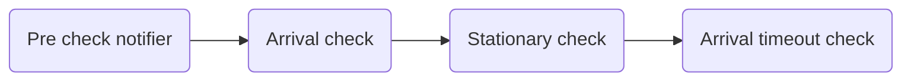

This chapter provides an overview of the implementation details of the **Location Service**.

## User Tracking and Real-time Management

The most important and critical feature of the Location Service is the **tracking** of the user's location and real-time management of their  state considering the high volume of data that needs to be processed in real-time.
Moreover, the service is in charge of the user monitoring during the _SOS_ and _Routing_ modes, which require to take real-time actions to ensure the user's safety.

For what concern the technology stack, the real-time location and user state updates are managed through the **WebSocket** protocol, which allows bidirectional communication between the client and the service.
While this is a common choice for real-time applications and it is well supported by the majority of the programming languages and frameworks, it is worth mentioning that the WebSocket protocol brings with it some challenges in terms of scalability of the service, which is a fundamental requirement for the system.
Indeed, each socket connection is bound to a specific instance of the service, which means it is needed to make sure that all the requests from specific users are forwarded to the same instance of the service.

One another important aspect to consider is that this service is intrinsically **stateful**: it needs to keep track of the user's location and state and take actions based on the history of the past updates and the current state.

To address these challenges we adopted a two-level approach.
First, the system has been designed and implemented with a **fully event-driven** approach, starting from the core of the service - the domain - on top of a "event reactions" mechanism.
Second, on the technological level, we selected a distributed actor framework based on **Akka Cluster** thanks to its capabilities to manage and allocate, in a location-transparent way, the actors across the cluster nodes, allowing to scale the service horizontally and to ensure the fault-tolerance of the system.

For these reasons the Location Service is implemented in **Scala**.

### Event reactions

The core of the Location Service is built around the [**event reactions** concept](https://github.com/position-pal/location-service/blob/main/domain/src/main/scala/io/github/positionpal/location/domain/EventReactionADT.scala), which represents the actions that the service takes in response to the service driving events.

Thanks to Scala, the event reactions are implemented as ADTs on top of a convenient DSL that allows to define and compose them as a pipeline in a functional way with a "short-circuit" semantic: if one step in the pipeline return a `Left` outcome (the opposite of a `Right` outcome) the pipeline stops and the result is returned to the caller.
This allows, in the future, to easily extend the pipeline with new steps without changing the existing ones, thus ensuring the extensibility and maintainability of the system.

The implemented pipeline is used to react to the `DrivingEvents` and take appropriate actions to track appropriately the user's location and state and is compose of the following steps:



1. **Pre check notifier**: this steps intercepts valuable events for which a notification has to be sent to the user.
2. **Arrival check**: this step checks if the user is in routing mode and has arrived at a specific location.
3. **Stationary check**: this step checks if the user is in routing mode and has become stuck in a specific location.
4. **Arrival timeout check**: this step checks if the user is in routing mode and has not arrived at the expected destination within the expected time.

For example, the following snippet shows the reaction 

```scala
object ArrivalCheck:

  def apply[F[_]: Async](using MapsService[F], NotificationService[F], UserGroupsService[F]): EventReaction[F] =
    on[F]: (session, event) =>
      event match
        case e: SampledLocation if session.tracking.exists(_.isMonitorable) =>
          for
            config <- ReactionsConfiguration.get
            tracking <- session.tracking.asMonitorable.get.pure[F]
            distance <- summon[MapsService[F]].distance(tracking.mode)(e.position, tracking.destination.position)
            isWithinProximity = distance.toMeters.value <= config.proximityToleranceMeters.meters.value
            _ <- if isWithinProximity then sendNotification(session.scope, successMessage) else Async[F].unit
          yield if isWithinProximity then Left(RoutingStopped(e.timestamp, e.user, e.group)) else Right(Continue)
        case _ => Right(Continue).pure[F]
```

They can be composed in a pipeline as follows:

```scala
  val reaction = (
    PreCheckNotifier[IO] >>> ArrivalCheck[IO] >>> StationaryCheck[IO] >>> ArrivalTimeoutCheck[IO]
  )(s, e)
```

### Akka Cluster to the rescue

Since the service should track a large number of users and their tracking information concurrently for each group, the actor model, and in particular, Akka is the perfect fit for this scenario since it can handle smoothly a huge number of actors per node thanks to their very light memory footprint.

In particular, the Location Service is implemented using the [Akka Cluster Sharding](https://doc.akka.io/docs/akka/current/typed/cluster-sharding.html) module, which allows to **distribute stateful actors** across the cluster nodes in a **location-transparent** way.
This means that the service can scale horizontally by adding more nodes to the cluster and the actors will be **automatically distributed** and, possibly, **rebalanced** across the nodes without any kind of intervention **from the underlying infrastructure**.
Moreover, the interaction between the actors is guided by their only _logical_ identifier despite their physical location.

Moreover, the Akka framework support the integration of websockets through the [Akka HTTP](https://doc.akka.io/docs/akka-http/current/index.html) module, which allows to easily expose the WebSocket endpoints to the clients and to manage the connections and their handlers through actors distributed across the cluster, zeroing the need for additional infrastructure components to deal with scaling and fault-tolerance.

For our purposes two main actor entities have been designed:

- `RealTimeUserTracker` actor which is responsible for managing and tracking a user in real-time in a specific group (recall different group may have different views of the user state and location);
- `GroupManager` actor which keeps track of all active websocket connections for a specific group (or, rather, all the actor references of the websocket handlers), acting as a _router_ for the messages between the `RealTimeUserTracker` actors and the clients.


The main flow is described in the following diagram:

1. the client application connects to the websocket endpoint exposed by the service and a new actor is created to handle the connection;
2. upon connection the websocket handler actor register itself to the appropriate `GroupManager` actor to receive the updates for the specific group it is interested in;
3. when the client application send a new `DrivingEvent` to the websocket handler actor through the websocket connection, it forwards the event to the the appropriate `RealTimeUserTracker` actor for the specific user and group the event is related to;
4. the `RealTimeUserTracker` actor reacts to the event and updates the user state and location accordingly (using the pipeline described above) sending the updated state and location to the `GroupManager` actor;
5. the `GroupManager` actor forwards the updates to all the registered websocket handler actors.

It is worth noting both the actors are sharded across the cluster nodes and, hence, it is not known in advance where they are located, but since the interaction is guided by their logical identifier, the system is able to route the messages to the correct actor even though they are located on different nodes from the one the client is connected to.


