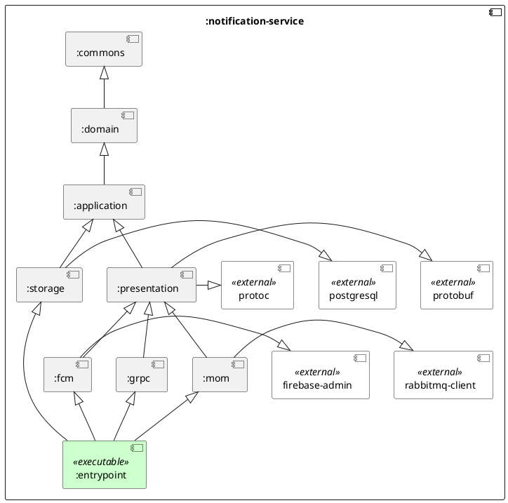

## High level overview and modules structure

Currently, the only supported notification types are **push notifications**, which are essential to guarantee that the client is immediately informed about groups changes or user state changes, like the trigger of the SOS alert or the journey start.



## Message broker (`:mom`)

Like already presented in the [Architecture]() section, the notification service is integrated with the message broker to receive notification commands from other microservices.


## Push Notifications (`:fcm`)

The microservice is integrated with **Firebase Cloud Messaging (FCM)** to send push notifications to the client application. 

FCM is a _cross-platform_ messaging solution provided by Google that enables developers to send notifications and data messages to apps running on _iOS_, _Android_, and _web platforms_.
It allows backend services to communicate with client applications by delivering messages _efficiently_ and _securely_.

FCM has been chosen over plain WebSockets, which are already used in the system for the real-time tracking of the user's position, due to several compelling reasons aligned with our specific requirements and infrastructure goals:

1. _Offline message handling_

   One of the core requirements for the notification service was to ensure message delivery even when users are temporarily offline or the client application is not in foreground.

   FCM natively supports these features: it delivers messages directly to the device's system tray, allowing users to interact with them to bring the application back to the foreground.
   If the device is offline, FCM temporarily queues the messages and ensures their delivery as soon as the device reconnects.
   These features guarantees that users receive all relevant notifications without requiring additional queuing mechanisms.

   

2. _Scalability and reliability_

   FCM is built on Google's infrastructure, offering seamless scalability without requiring to manage servers, load balancers, or clustering mechanisms.
   It can handle millions of messages per day effortlessly, with built-in queuing and retry mechanisms for undelivered messages.

   On the other hand, WebSocket infrastructure demands significant engineering effort to manage load balancing and scaling.

3. _Security and Authentication_

   Firebase Cloud Messaging employs OAuth 2.0 for secure authentication of API requests, ensuring that only authorized services can send messages. All communications are encrypted using TLS by default, simplifying compliance with security standards.

4. _Aligned with Use Case: One-Way Notifications_

   The primary function of the notification service is to send one-way notifications from backend systems to users' devices, not to enable full-duplex communication. FCM is purpose-built for this scenario, providing optimized delivery for both notification messages (visible alerts) and data messages (background processing).

   While WebSockets shine in scenarios requiring continuous, bidirectional communication—such as chat apps or live data feeds—they add unnecessary complexity for our needs, where responses from clients are not required.

### Lifecycle flow

The lifecycle of a push notification message follows these steps:

1. The client app registers the device to FCM, obtaining a registration token that uniquely identifies the app instance. This is direct client app responsibility;
2. The client sends the registration token to the notification service, associating it with the user's account, through a gRPC API;
3. When a new notification is triggered by one of the other microservices through the message broker, a notification message is composed and sent to the FCM backend using the registration token;
4. The FCM backend delivers the message to the device with the corresponding registration token.

In this process, the notification service is responsible for handling the registration and invalidation of device tokens, as well as the composition and delivery of notification messages to the FCM backend.

### Notifications Publisher

The logic for sending notifications is encapsulated in the `fcm` adapter module.

```kotlin
/**
 * A notifications publisher sending notifications using Firebase Cloud Messaging.
 */
class FirebaseCloudNotificationPublisher(
    private val firebase: Firebase,
    private val usersTokensRepository: UsersTokensRepository,
    groupsRepository: GroupsRepository,
) : BasicNotificationPublisher(groupsRepository) {

    override suspend fun send(message: NotificationMessage, userIds: Set<UserId>) =
        userIds.map { usersTokensRepository.get(it) }.forEach {
            it.mapCatching { userTokens ->
                userTokens.forEach { userToken -> firebase.sendMessage(userToken.token, message) }
            }.onFailure { err -> logger.error("Failure in sending notification {}: {}", message, err.message) }
        }

    private companion object {
        private val logger = LoggerFactory.getLogger(this::class.java)
    }
}
```

```kotlin
/**
 * A Firebase client facade to send notifications.
 */
class Firebase private constructor(private val app: FirebaseMessaging) {

    /**
     * Configuration for the Firebase client.
     * @property serviceAccountFilePath The absolute path to the service account file.
     */
    data class Configuration(
        val serviceAccountFilePath: String,
    )

    /** Sends the given [notificationMessage] using the specified [token]. */
    fun sendMessage(token: Token, notificationMessage: NotificationMessage) = runCatching {
        val notification = Notification.builder()
            .setTitle(notificationMessage.title())
            .build()
        val message = Message.builder()
            .setNotification(notification)
            .putData("title", notificationMessage.title())
            .putData("body", notificationMessage.body())
            .setToken(token)
            .build()
        app.send(message)
    }

    /** A factory for creating instances of [Firebase]. */
    companion object {
        private const val APP_ID = "notification-service"

        /** Creates a new instance of [Firebase] using the given [configuration]. */
        fun create(configuration: Configuration): Result<Firebase> = runCatching {
            val serviceAccountFilePath =
                File(configuration.serviceAccountFilePath)
                    .takeIf { it.exists() && it.isFile && it.extension == "json" }
                    ?.absolutePath
                    ?: error("${configuration.serviceAccountFilePath} is not present or is not a valid account file!")
            val credentials = GoogleCredentials.fromStream(FileInputStream(serviceAccountFilePath))
            val options = FirebaseOptions.builder()
                .setCredentials(credentials)
                .build()
            return Result.success(Firebase(FirebaseMessaging.getInstance(FirebaseApp.initializeApp(options, APP_ID))))
        }
    }
}
```

### API (`:grpc`)

The client can register the device token obtained from FCM to the notification service through a gRPC API, whose protobuf definition is as follows:

```protobuf
service UsersTokensService {
    rpc Register(UserToken) returns (EmptyResponse);
    rpc Invalidate(UserToken) returns (EmptyResponse);
}

message UserToken {
    string user = 1;
    string token = 2;
}

message Status {
    StatusCode code = 1;
    optional string message = 2;
}

enum StatusCode {
    OK = 0;
    CONFLICT = 1;
    NOT_FOUND = 2;
    GENERIC_ERROR = 3;
}

message EmptyResponse {
    Status status = 1;
}
```
