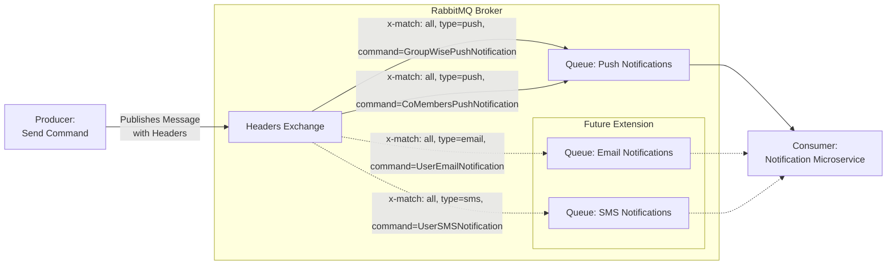

<!--## High level overview and modules structure-->

Currently, the only supported notification types are **push notifications**, which are essential to guarantee that the client is immediately informed about groups changes or user state changes, like the trigger of the SOS alert or the journey start.

<!--


-->

## Notification commands

Like already presented in the [Architecture Design](/docs/3-arch-design/2-architecture-design/) section, the notification service is integrated with the message broker to receive notification commands from other microservices.

It does this via a **durable** **header**-based **exchange** named `push-notifications` to which other services can publish the notifications commands presented in the [Shared Kernel design section](/docs/4-detailed-design/1-shared-kernel).
The notification service is expected to find in the message header the type of the command (i.e. the `CommandType` in the shared-kernel class diagram) so that it can handle the notification accordingly.

The choice of a header-based exchange has been made to allow the notification service to bound multiple queues to the same exchange, each one with a different set of headers, to handle different types of notifications, in a extensible and scalable way.
Indeed, looking to extendibility, the notification service can be easily extended to handle new types of notifications by adding new queues bound to the `push-notifications` exchange, each one with a different set of headers.
In fact, the header-based exchange is a type of exchange that routes messages based on the value of the message header.
When a message is published to the exchange, the exchange will inspect the header of the message and route it to the queues that are bound to the exchange based on the header values.



The fact the exchange is durable ensures that the exchange will survive a broker restart, and the messages published to it will be persisted until they are delivered to a consumer notification instance.

The concrete implementation is as follows.
As you can see, the `RabbitMQNotificationsConsumer` class is responsible for handling the incoming messages from the broker and dispatching them to the appropriate service handler based on the message type and in accordance to DDD's building blocks.
The **Kotlin Coroutines** library is used to handle the asynchronous processing of the messages:

```kotlin
/**
 * RabbitMQ notification commands consumer adapter.
 */
class RabbitMQNotificationsConsumer(
    private val notificationPublisher: NotificationPublisher,
    configuration: RabbitMQ.Configuration,
    dispatcher: CoroutineDispatcher = Dispatchers.IO,
) : RabbitMQMessageHandler(configuration) {

    private val scope = CoroutineScope(SupervisorJob() + dispatcher)
    private val serializer = AvroSerializer()

    override fun RabbitMQClient.onChannelCreated(channel: Channel) {
        // 1. Declare the headers exchange
        channel.declareHeadersExchange(PUSH_NOTIFICATIONS_EXCHANGE)
        // 2. Bind a queue to the exchange
        channel.declareBindAndRegisterCallbackTo(PUSH_NOTIFICATIONS_EXCHANGE) { props, body ->
            // 3. Attach a callback to properly handle the incoming messages
            val messageType = props.headers["message_type"].toString()
            when (messageType) {
                CommandType.GROUP_WISE_NOTIFICATION.name -> handleGroupWiseNotification(body)
                CommandType.CO_MEMBERS_NOTIFICATION.name -> handleCoMembersNotification(body)
                else -> logger.debug("Received unknown message type: {}", messageType)
            }
        }
    }

    private fun handleGroupWiseNotification(body: ByteArray) = scope.launch {
        val command = serializer.deserializeGroupWiseNotification(body)
        logger.debug("Handling group wise notification event {}", command)
        with(notificationPublisher) {
            send(command.message()) toAllMembersOf command.recipient()
        }
    }

    private fun handleCoMembersNotification(body: ByteArray) = scope.launch {
        val command = serializer.deserializeCoMembersNotification(body)
        logger.debug("Handling co-members notification event {}", command)
        with(notificationPublisher) {
            send(command.message()) toAllMembersSharingGroupWith command.sender()
        }
    }

    internal companion object {
        internal const val PUSH_NOTIFICATIONS_EXCHANGE = "push-notifications"
    }
}
```

## Push Notifications

The microservice is integrated with **Firebase Cloud Messaging (FCM)** to send push notifications to the client application. 

FCM is a _cross-platform_ messaging solution provided by Google that enables developers to send notifications and data messages to apps running on _iOS_, _Android_, and _web platforms_.
It allows backend services to communicate with client applications by delivering messages _efficiently_ and _securely_.

FCM has been chosen over plain WebSockets, which are already used in the system for the real-time tracking of the user's position, due to several compelling reasons aligned with our specific requirements and infrastructure goals:

1. _Offline message handling_

   One of the core requirements for the notification service was to ensure message delivery even when users are temporarily offline or the client application is not in foreground.

   FCM natively supports these features: it delivers messages directly to the device's system tray, allowing users to interact with them to bring the application back to the foreground.
   If the device is offline, FCM temporarily queues the messages and ensures their delivery as soon as the device reconnects.
   These features guarantees that users receive all relevant notifications without requiring additional queuing mechanisms.

   

2. _Scalability and reliability_

   FCM is built on Google's infrastructure, offering seamless scalability without requiring to manage servers, load balancers, or clustering mechanisms.
   It can handle millions of messages per day effortlessly, with built-in queuing and retry mechanisms for undelivered messages.

   On the other hand, WebSocket infrastructure demands significant engineering effort to manage load balancing and scaling.

3. _Security and Authentication_

   Firebase Cloud Messaging employs OAuth 2.0 for secure authentication of API requests, ensuring that only authorized services can send messages. All communications are encrypted using TLS by default, simplifying compliance with security standards.

4. _Aligned with Use Case: One-Way Notifications_

   The primary function of the notification service is to send one-way notifications from backend systems to users' devices, not to enable full-duplex communication. FCM is purpose-built for this scenario, providing optimized delivery for both notification messages (visible alerts) and data messages (background processing).

   While WebSockets shine in scenarios requiring continuous, bidirectional communication—such as chat apps or live data feeds—they add unnecessary complexity for our needs, where responses from clients are not required.

### Lifecycle flow

The lifecycle of a push notification message follows these steps:

1. The client app registers the device to FCM, obtaining a registration token that uniquely identifies the app instance. This is direct client app responsibility;
2. The client sends the registration token to the notification service, associating it with the user's account, through a gRPC API;
3. When a new notification is triggered by one of the other microservices through the message broker, a notification message is composed and sent to the FCM backend using the registration token;
4. The FCM backend delivers the message to the device with the corresponding registration token.

In this process, the notification service is responsible for handling the registration and invalidation of device tokens, as well as the composition and delivery of notification messages to the FCM backend.

### Notifications Publisher

The logic for sending notifications is encapsulated in the `fcm` adapter module.

```kotlin
/**
 * A notifications publisher sending notifications using Firebase Cloud Messaging.
 */
class FirebaseCloudNotificationPublisher(
    private val firebase: Firebase,
    private val usersTokensRepository: UsersTokensRepository,
    groupsRepository: GroupsRepository,
) : BasicNotificationPublisher(groupsRepository) {

    override suspend fun send(message: NotificationMessage, userIds: Set<UserId>) =
        userIds.map { usersTokensRepository.get(it) }.forEach {
            it.mapCatching { userTokens ->
                userTokens.forEach { userToken -> firebase.sendMessage(userToken.token, message) }
            }.onFailure { 
                err -> logger.error("Failure in sending notification {}: {}", message, err.message) 
            }
        }

    private companion object {
        private val logger = LoggerFactory.getLogger(this::class.java)
    }
}
```

```kotlin
/**
 * A Firebase client facade to send notifications.
 */
class Firebase private constructor(private val app: FirebaseMessaging) {

    /**
     * Configuration for the Firebase client.
     * @property serviceAccountFilePath The absolute path to the service account file.
     */
    data class Configuration(
        val serviceAccountFilePath: String,
    )

    /** Sends the given [notificationMessage] using the specified [token]. */
    fun sendMessage(token: Token, notificationMessage: NotificationMessage) = runCatching {
        val notification = Notification.builder()
            .setTitle(notificationMessage.title())
            .build()
        val message = Message.builder()
            .setNotification(notification)
            .putData("title", notificationMessage.title())
            .putData("body", notificationMessage.body())
            .setToken(token)
            .build()
        app.send(message)
    }

    /** A factory for creating instances of [Firebase]. */
    companion object {

        /** Creates a new instance of [Firebase] using the given [configuration]. */
        fun create(configuration: Configuration): Result<Firebase> = runCatching { ... }
    }
}
```

### API

The client can register the device token obtained from FCM to the notification service through a gRPC API, whose Protobuf definition is as follows:

```protobuf
service UsersTokensService {
    rpc Register(UserToken) returns (EmptyResponse);
    rpc Invalidate(UserToken) returns (EmptyResponse);
}

message UserToken {
    string user = 1;
    string token = 2;
}

message Status {
    StatusCode code = 1;
    optional string message = 2;
}

enum StatusCode {
    OK = 0;
    CONFLICT = 1;
    NOT_FOUND = 2;
    GENERIC_ERROR = 3;
}

message EmptyResponse {
    Status status = 1;
}
```

Its implementation is in the concrete gRPC adapter leveraging **Kotlin Coroutines**:

```kotlin
class GrpcUsersTokensService(
    private val usersTokensService: UsersTokensService,
) : UsersTokensServiceGrpcKt.UsersTokensServiceCoroutineImplBase() {

    override suspend fun register(request: Proto.UserToken): Proto.EmptyResponse = 
        with(request.toKt()) {
            executeServiceCall { usersTokensService.register(userId, token) }
        }

    override suspend fun invalidate(request: Proto.UserToken): Proto.EmptyResponse = 
        with(request.toKt()) {
            executeServiceCall { usersTokensService.invalidate(userId, token) }
        }

    private suspend fun <T> executeServiceCall(call: suspend () -> Result<T>): Proto.EmptyResponse =
        call().fold(
            onFailure = { handleError(it) },
            onSuccess = { createResponse(StatusCode.OK) },
        )

    private fun handleError(error: Throwable): Proto.EmptyResponse =
        when (error) {
            is Conflict -> createResponse(StatusCode.CONFLICT, error.message)
            is NotFound -> createResponse(StatusCode.NOT_FOUND, error.message)
            else -> createResponse(StatusCode.GENERIC_ERROR, error.message)
        }

    private fun createResponse(code: StatusCode, message: String? = null): Proto.EmptyResponse =
        emptyResponse {
            status = status {
                this.code = code
                message?.let { this.message = it }
            }
        }
}
```

### Storage

Similarly to the [User service](/docs/5-implementation/4-user-groupd-service/), the notification service uses a PostgreSQL database to store the user's device tokens and groups information, leveraging the [Ktor](https://ktor.io/) framework's `Exposed` library for database access.
