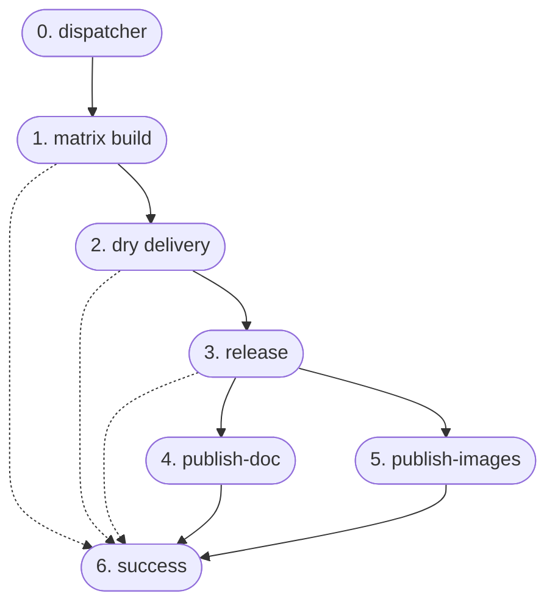

## Build Automation

### Scala Extras

## Continuous Integration and Delivery

```mermaid
graph TB;
  dispatcher(["0. dispatcher"])
  dispatcher --> build;
  build(["1. matrix build"]);
  dry-delivery(["2. dry delivery"])
  build --> dry-delivery;
  release(["3. release"])
  dry-delivery --> release;
  publish-images(["5. publish-images"])
  release --> publish-images;
  publish-doc(["4. publish-doc"])
  release --> publish-doc;
  success(["6. success"])
  build .-> success
  dry-delivery .-> success
  release .-> success
  publish-doc --> success
  publish-images --> success;
```

## Bots

## Continuous Deployment
