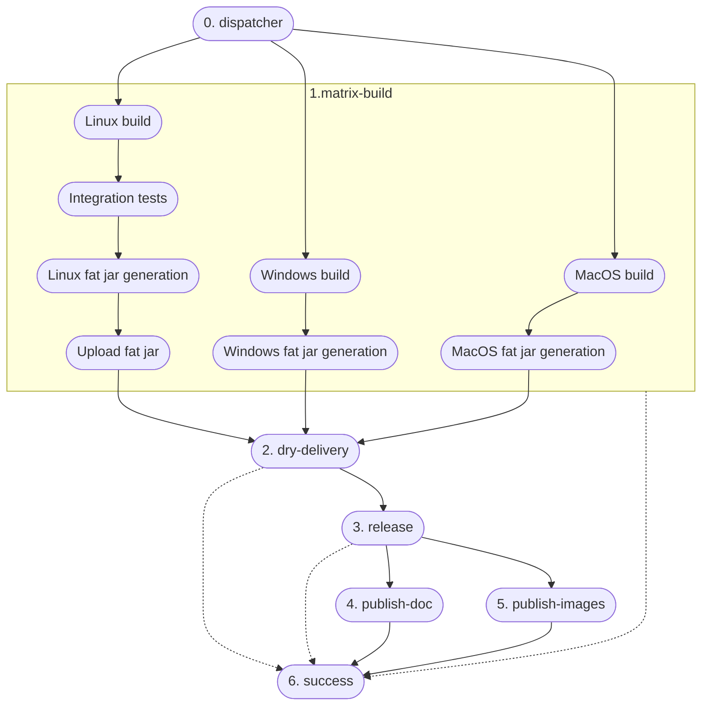
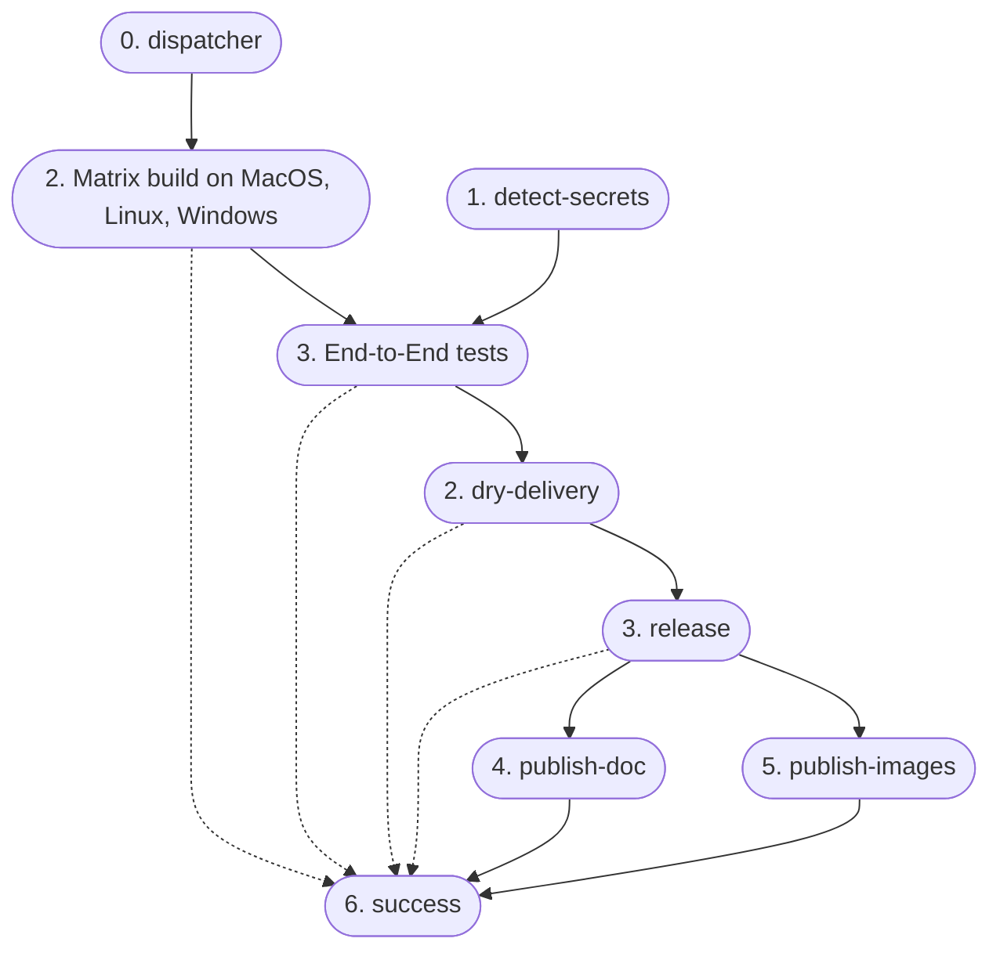

## Build Automation

Since all microservices are JVM-based (Scala and Kotlin) **Gradle** have been chosen as the build automation tool.

Regarding the frontend and the gateway, since they are both written in Javascript, the team has chosen **npm** as the build automation tool.

In the following sections we provide an overview of the relevant configurations and plugins used in the project.

### Projects Structure and shared kernel package

The team has decided to implement the microservices using a **one-repository-per-service** approach, with each service managed as an **independent** Gradle project, where Gradle sub-projects are used to structure the code, mapping each layer and adapter in the Hexagonal Architecture to a dedicated sub-project.

The choice of adopting a _one-repository-per-service_ approach over a _mono-repo_ was made to ensure that each microservice can be developed, tested, and deployed independently from the others, allowing for a more flexible and scalable development process, including a faster build time and CI/CD pipeline execution and an easier management of the codebase dependencies.
However, this approach has some drawbacks, such as the need to setup and configure the build tools for each project with a consistent configuration and, especially, how to handle common code across the different microservices.

The first problem has been partially mitigated by the use of **GitHub Templates**, which allowed us to create template repositories with a common structure and configuration that can be used to bootstrap new projects (you can find [here the Scala template](https://github.com/position-pal/scala-template) and [here the Kotlin template](https://github.com/position-pal/kotlin-template)).

The second problem has been faced with the _shared kernel_.
Indeed, code inside the _shared kernel_ must be shared across all the microservices and must be kept in sync with the latest changes.
To achieve this, the team has decided to create a separate Gradle project and publish it as a package on a package registry so that it can be included as a normal dependency in all the Gradle builds.
Since the code is tightly bound to the project and not intended for public reuse, **GitHub Packages** was selected as the publishing repository ([here](https://github.com/orgs/position-pal/packages?repo_name=shared-kernel) the link to the published packages).



Here is an example of how to include the shared kernel in a Gradle project:

```kotlin
repositories {
    mavenCentral()
    maven {
        url = uri("https://maven.pkg.github.com/position-pal/shared-kernel")
        credentials {
            username = project.findProperty("gpr.user") as String? ?: System.getenv("GPR_USER")
            password = project.findProperty("gpr.key") as String? ?: System.getenv("GPR_KEY")
        }
    }
}

dependencies {
    implementation("io.github.positionpal:kernel-domain:<VERSION>")
    implementation("io.github.positionpal:kernel-presentation:<VERSION>")
}
```

### Scala Extras Gradle Plugin

While in Kotlin using Gradle is a no-brainer choice and there exist a plethora of plugins and tools to automate the build process, in Scala the situation is a bit different.
For this reason, a custom Gradle plugin has been implemented, called [**Scala Extras**](https://github.com/tassiluca/gradle-scala-extras) to enhance the configuration and build process of all the Scala projects in one place.

The plugin, published on _Maven Central_ and on the _Gradle Plugin Portal_, provides the following features:

- Support for [_Scalafix_](https://scalacenter.github.io/scalafix/) and [_Scalafmt_](https://scalameta.org/scalafmt/) with a default configuration that can be possibly overridden;
- Aggressive Scala compiler option to treat warnings as errors is applied by default (still configurable);
- Out-of-the-box configuration to generate aggregated subprojects [_scaladoc_](https://docs.scala-lang.org/style/scaladoc.html) (which is not supported by the  Scala Gradle plugin).

By default, applying the plugin to a project is sufficient to enable all the features with the default configuration: in accordance with the standard practices of the Scala community, the plugin will automatically use the `.scalafix.conf` and/or `.scalafmt.conf` files if they are present in the root directory of the project.
Otherwise, the plugin provides a way to override the default configuration, if needed:

```kotlin
scalaExtras {
    qa { 
        allWarningsAsErrors = false
        scalafix {
            configFile = "stringified path to the scalafix configuration"
        }
        scalafmt {
            configFile = "stringified path to the scalafmt configuration"
        } 
    }
}
```

The plugin add the following tasks to the project:

- `format` to automatically format the Scala source code adhering to the QA supported tools configuration;
- `aggregateScaladoc` to generate the aggregated _scaladoc_ for all the subprojects, including the root one.

Moreover, the `check` task is enhanced to run all the QA tools before the tests, ensuring that the code is compliant with the standards:

## Version control & Repository management

### DVCS workflow

We have chosen to work with a single stable branch, the `main` branch, which always contains the latest working version of the code.
All development is done in separate branches, such as `feature/name` for new features, `fix/name` for bug fixes.
Once the changes are ready, they are submitted through pull requests (PRs) to be merged into the main branch.
As a team guideline, PRs are **_rebased_** on the main branch if it is self-contained and their commits are significant and need to be kept in the history.
Otherwise, if the PR is made of many commits (each of which with some experiments) and the history is not relevant, a **_squash_** strategy is adopted.
**No merge commits** are allowed in the main branch, since we want to keep the history _clean_ and _linear_.

Each pull request is reviewed and must be approved by at least one other developer before it's merged.

The main branch is also where all releases are made, ensuring consistency in the release process.

Commits are structured following the **[Conventional Commits](https://www.conventionalcommits.org/en/v1.0.0/)** standard, which allows for automatic versioning and changelog generation.

Moreover, all teams members use commit signing to ensure the integrity of the codebase.

### Git hooks

To enforce the use of the _Conventional Commits_ standard and _Quality Assurance_ tools (described in the [Validation section](http://localhost:1313/docs/6-validation/validation/#quality-assurance)) each project is equipped with Git hooks that prevent committing code that does not comply with the standards.
Where tests are fast the hooks are also configured to run also the tests before the commit.
Sometimes, however, repositories contain integration tests that are more time-consuming and would unacceptably slow down the development process.
In these cases only the _linting_ and _formatting_ tools are run (along with the _Conventional Commits_ check).
This is not a problem since the CI/CD pipeline will run all the tests for each pushed commit, intercepting any possible regression at any time, preventing the main branch from being polluted with broken code.

### Branch Protections

To ensure the stability of the main branch, the team has decided to enable the following branch protections:

- **Restrict deletions** to prevent the main branch from being deleted
- **Require linear history** to prevent merge commits from being pushed to the main branch
- **Block force pushes** to prevent users from force pushing to the main branch

### Semantic versioning and release

Each repository is versioned following the **Semantic Versioning** standard and is **fully automated** using **Semantic Release**.
This tool is integrated into the CI/CD pipeline and, after successfully passing the tests, automatically analyzes the commit message to determine whether a new version should be released.
If a release is needed, it calculates the new version number, generates the changelog, and creates a new release on GitHub.

### Automated dependency updates

To keep the dependencies up-to-date **Renovate** has been integrated in every repository and its configuration can be found [here](https://github.com/position-pal/renovate-config/blob/main/default.json).

Since the Shared Kernel is published as a package on GitHub Packages the following custom `hostRule` has been added to the configuration to ensure that the Bot is able to look for updates in the correct repository:

```json
"hostRules": [
    {
        "hostType": "maven",
        "matchHost": "maven.pkg.github.com",
        "token": "{{ secrets.GH_PACKAGES_TOKEN }}"
    }
]
```

Moreover, to make sure to trigger a new **minor relase** when any Position Pal package (including the Shared Kernel) or Docker Image is updated, the following configuration has been added.

```json
{
    "description": "PositionPal packages must be scoped as `api-deps`",
    "matchPackageNames": [
        "/.*position[-]?pal.*/"
    ],
    "semanticCommitScope": "api-deps"
},
{
    "description": "Exceptionally, some PositionPal packages should be scoped as normal `deps`",
    "matchPackageNames": [
        "/.*position[-]?pal\\\/local-deployment.*/"
    ],
    "semanticCommitScope": "deps"
}
```

This will tag the corresponding update commit with `api-deps` scope, triggering a new minor release by Semantic Release once correctly merged in the main branch.
This ensures that the consumers of every Position Pal package and image are always up-to-date with the latest changes.

## Continuous Integration and Delivery

The _Continuous Integration_ pipeline of all microservices is described by the following diagram:



- **Dispatcher**: the dispatcher is a workflow acting as a filter to ensure that the pipeline runs only when necessary. In particular, it prevents running the entire workflow twice on PRs made by a branch of the same repository, which by default happens when a PR is opened from the repository itself (given both `push` and `pull_request` events are triggered).
- **Build**: a _matrix_ job that assemble, test and run all checks on the codebase on different platforms (MacOS, Linux, Windows) for different JVM versions (17, 21). Moreover it tries to generate a fat jar for the service and, if successful, it caches it for the next steps in order to speed up the process, avoiding to reassemble the project.
  - If integration tests that require running a Docker service exists, they are only on _Linux_ since the GitHub Actions runner does not support Docker on MacOs and Windows. This is achieved by applying a similar build configuration shown below only to the necessary modules that contain integration tests:

    ```kotlin
    normally {
        dockerCompose {
            startedServices = listOf("cassandra-init", "cassandra-db")
            isRequiredBy(tasks.test)
        }
    } except { inCI and (onMac or onWindows) } where {
        tasks.test { enabled = false }
    } cause "GitHub Actions runner does not support Docker containers"
    ```

- **Dry-delivery**: a job that attempts to create a multi-platform docker image out of the generated fat jar.
- **Release**: a job that runs the Semantic Release tool to determine if a new version should be released and, if so, it creates a new release on GitHub.
- **Publish-doc**: a concurrent job that generates the documentation for the project and publishes it on GitHub Pages.
- **Publish-images**: a concurrent job that publishes the multi-platform docker image on the DockerHub registry.
- **Success**: the final job that runs successfully if all the previous steps have not failed.

For the Gateway, a custom pipeline has been designed to take into account the fact that it hosts the end-to-end tests.
Indeed, in order to correctly run them, they need to have configured a set of secrets, including the Mapbox API key, the Firebase configuration file and the Akka license key.
These are available only in the repository and cannot be used in forks or in PRs from forks to prevent the secrets from being exposed.
For this reason, the pipeline is designed to detect if the workflow have access to the required secrets and, if not, it skips the end-to-end tests.
In case a PR is opened from a fork, a comment is automatically triggered to warn the contributor a review from a team member is required to validate the changes and then push them to a pre-release branch where the secrets are available and the end-to-end tests can be run.
Once also the end-to-end tests are successful, the PR can be merged into the main branch.

The modified workflow for the gateway is depicted in the following diagram:



## Additional Bots & Tools

### Mergify

To automate the PRs merging process, the **Mergify** bot has been integrated into the repositories and configured to:

- automatically request reviews for non-bot PRs;
- automatically merge PRs authored by a bot if they pass the CI/CD pipeline;
- automatically and immediately merge PRs that have been approved by at least two reviewers and pass the CI/CD pipeline based on a _label_ that specify the merge strategy (`rebase` or `squash`);
- automatically merge PRs that have been approved by at least one reviewer, pass the CI/CD pipeline and have been unmodified for at least 4 hours;
- automatically delete branches after the PR has been merged.
- automatically comment on PRs that have conflicts or do not respect the Conventional Commits standard.

Merge protections are in place to ensure merges are performed only when the `success` job of the CI pipeline is successful, not unresolved conversations are present, and no conflicts are present.

The complete configuration can be found [here](https://github.com/position-pal/mergify-config/blob/main/.mergify.yml).

### SonarCloud

We've integrated _SonarCloud_ into our repositories to run automatically within our CI pipeline, in addition to the static quality plugins already integrated into our build tool. This ensures continuous monitoring of code quality, detecting issues such as bugs, code smells, and security vulnerabilities. By identifying bad coding patterns and potential risks early, we enhance maintainability, reduce technical debt, and improve overall software security and reliability.

## Continuous Deployment
Each microservice is deployed on a Kubernetes cluster using Helm charts maintained in separate repositories and versioned according to Semantic Versioning standards. Upon release of a new version, the corresponding Helm chart is updated and published to ghcr.io through an automated CI/CD pipeline that handles all necessary deployment steps.

 We maintain and deploy the cluster state using Terraform, with infrastructure defined in a dedicated [repository](https://github.com/position-pal/position-pal-terraform), specifically in the `plan` folder where all configuration settings are centralized for better organization. To update infrastructure, we modify the configuration files and create a pull request, which triggers the comprehensive CD pipeline to manage deployment using the [HashiCorp Cloud Platform](https://developer.hashicorp.com/terraform/cloud-docs) (HCP) Service: a robust managed solution that securely stores infrastructure state, prevents conflicts between developers working simultaneously, and handles secrets and sensitive data with appropriate security measures. 
 
 When a pull request is opened, the pipeline automatically runs a plan to preview potential changes and adds the detailed output as a comment to the PR for thorough review by team members. Once the changes are approved and the PR is merged into the main branch, the pipeline executes applay to execute the infrastructure changes in a controlled and documented manner.


## License

The project is licensed under the **Apache License 2.0**.
