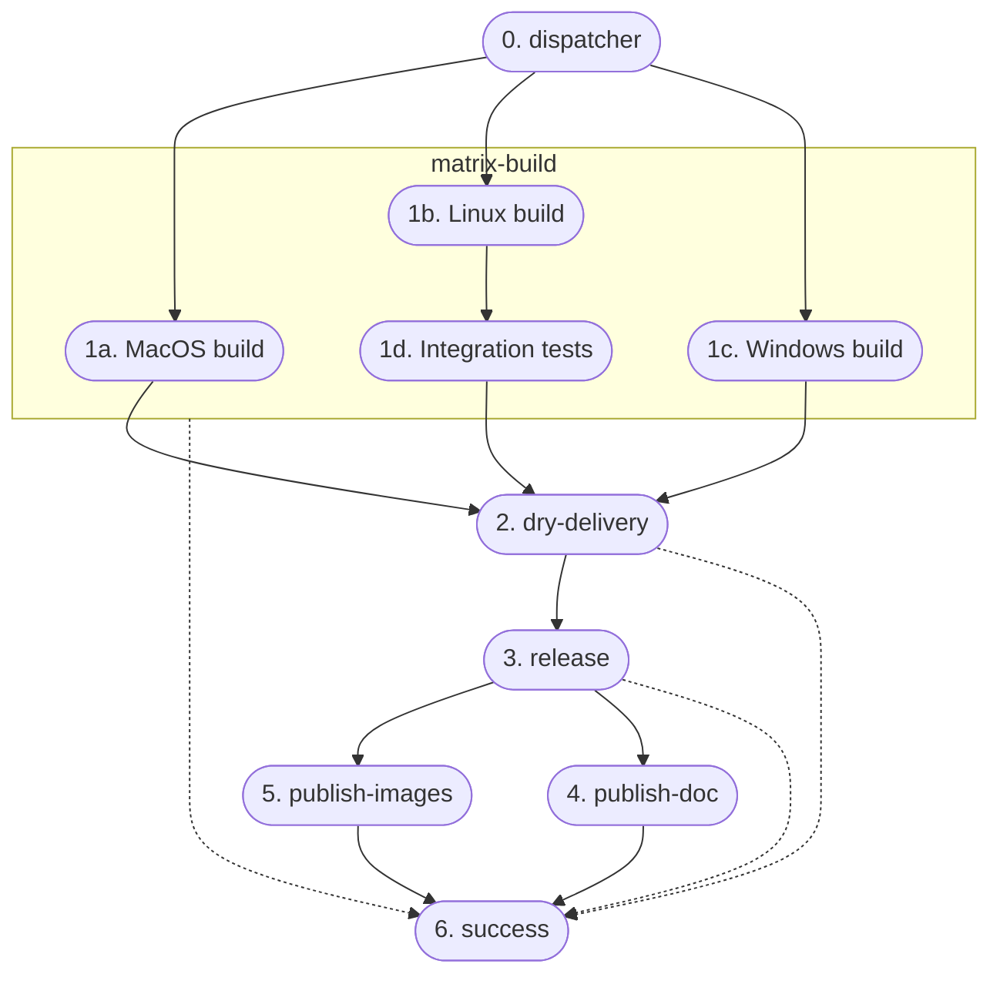

## Build Automation

Since all microservices are JVM-based (Scala and Kotlin) **Gradle** have been chosen as the build automation tool.

Regarding the frontend and the gateway, since they are both written in Javascript, the team has chosen **npm** as the build automation tool.

In the following sections we provide an overview of the relevant configurations and plugins used in the project.

### Projects Structure and shared kernel package

The team has decided to implement the microservices using a **one-repository-per-service** approach, with each service managed as an **independent** Gradle project, where Gradle sub-projects are used to structure the code, mapping each layer and adapter in the Hexagonal Architecture to a dedicated sub-project.

The choice of adopting a _one-repository-per-service_ approach over a _mono-repo_ was made to ensure that each microservice can be developed, tested, and deployed independently from the others, allowing for a more flexible and scalable development process, including a faster build time and CI/CD pipeline execution and an easier management of the codebase dependencies.
However, this approach has some drawbacks, such as the need to setup and configure the build tools for each project with a consistent configuration and, especially, how to handle common code across the different microservices.

The first problem has been partially mitigated by the use of **GitHub Templates**, which allowed us to create template repositories with a common structure and configuration that can be used to bootstrap new projects.

The second problem has been faced with the _shared kernel_.
Indeed, code inside the _shared kernel_ must be shared across all the microservices and must be kept in sync with the latest changes.
To achieve this, the team has decided to create a separate Gradle project and publish it as a package on a package registry so that it can be included as a normal dependency in all the Gradle builds.
Since the code is tightly bound to the project and not intended for public reuse, **GitHub Packages** was selected as the publishing repository ([here](https://github.com/orgs/position-pal/packages?repo_name=shared-kernel) the link to the published packages).



Here is an example of how to include the shared kernel in a Gradle project:

```kotlin
repositories {
    mavenCentral()
    maven {
        url = uri("https://maven.pkg.github.com/position-pal/shared-kernel")
        credentials {
            username = project.findProperty("gpr.user") as String? ?: System.getenv("GPR_USER")
            password = project.findProperty("gpr.key") as String? ?: System.getenv("GPR_KEY")
        }
    }
}

dependencies {
    implementation("io.github.positionpal:kernel-domain:<VERSION>")
    implementation("io.github.positionpal:kernel-presentation:<VERSION>")
}
```

### Scala Extras Gradle Plugin

While in Kotlin using Gradle is a no-brainer choice and there exist a plethora of plugins and tools to automate the build process, in Scala the situation is a bit different.
For this reason, a custom Gradle plugin has been implemented, called [**Scala Extras**](https://github.com/tassiluca/gradle-scala-extras) to enhance the configuration and build process of all the Scala projects in one place.

The plugin, published on _Maven Central_ and on the _Gradle Plugin Portal_, provides the following features:

- Support for [_Scalafix_](https://scalacenter.github.io/scalafix/) and [_Scalafmt_](https://scalameta.org/scalafmt/) with a default configuration that can be possibly overridden;
- Aggressive Scala compiler option to treat warnings as errors is applied by default (still configurable);
- Out-of-the-box configuration to generate aggregated subprojects [_scaladoc_](https://docs.scala-lang.org/style/scaladoc.html) (which is not supported by the  Scala Gradle plugin).

By default, applying the plugin to a project is sufficient to enable all the features with the default configuration: in accordance with the standard practices of the Scala community, the plugin will automatically use the `.scalafix.conf` and/or `.scalafmt.conf` files if they are present in the root directory of the project.
Otherwise, the plugin provides a way to override the default configuration, if needed:

```kotlin
scalaExtras {
    qa { 
        allWarningsAsErrors = false
        scalafix {
            configFile = "stringified path to the scalafix configuration"
        }
        scalafmt {
            configFile = "stringified path to the scalafmt configuration"
        } 
    }
}
```

The plugin add the following tasks to the project:

- `format` to automatically format the Scala source code adhering to the QA supported tools configuration;
- `aggregateScaladoc` to generate the aggregated _scaladoc_ for all the subprojects, including the root one.

Moreover, the `check` task is enhanced to run all the QA tools before the tests, ensuring that the code is compliant with the standards:

## Version control & Repository management

### DVCS workflow

We have chosen to work with a single stable branch, the `main` branch, which always contains the latest working version of the code.
All development is done in separate branches, such as `feature/name` for new features, `fix/name` for bug fixes.
Once the changes are ready, they are submitted through pull requests (PRs) to be merged into the main branch.
As a team guideline, PRs are **_rebased_** on the main branch if it is self-contained and their commits are significant and need to be kept in the history.
Otherwise, if the PR is made of many commits (each of which with some experiments) and the history is not relevant, a **_squash_** strategy is adopted.
**No merge commits** are allowed in the main branch, since we want to keep the history _clean_ and _linear_.

Each pull request is reviewed and must be approved by at least one other developer before it's merged.

The main branch is also where all releases are made, ensuring consistency in the release process.

Commits are structured following the **[Conventional Commits](https://www.conventionalcommits.org/en/v1.0.0/)** standard, which allows for automatic versioning and changelog generation.

Moreover, all teams members use commit signing to ensure the integrity of the codebase.

### Git hooks

To enforce the use of the _Conventional Commits_ standard and _Quality Assurance_ tools (described in the [Validation section](http://localhost:1313/docs/6-validation/validation/#quality-assurance)) each project is equipped with Git hooks that prevent committing code that does not comply with the standards.
Where tests are fast the hooks are also configured to run also the tests before the commit.
Sometimes, however, repositories contain integration tests that are more time-consuming and would unacceptably slow down the development process.
In these cases only the _linting_ and _formatting_ tools are run (along with the _Conventional Commits_ check).
This is not a problem since the CI/CD pipeline will run all the tests for each pushed commit, intercepting any possible regression at any time, preventing the main branch from being polluted with broken code.

### Branch Protections

To ensure the stability of the main branch, the team has decided to enable the following branch protections:

- **Restrict deletions** to prevent the main branch from being deleted
- **Require linear history** to prevent merge commits from being pushed to the main branch
- **Block force pushes** to prevent users from force pushing to the main branch

### Semantic versioning and release

Each repository is versioned following the **Semantic Versioning** standard and is **fully automated** using the **Semantic Release** tool.
This tool automatically determines the next version number based on the commit messages and generates the changelog.
It then creates a new release on GitHub.

## Continuous Integration and Delivery



```kotlin
normally {
    dockerCompose {
        startedServices = listOf("cassandra-init", "cassandra-db")
        isRequiredBy(tasks.test)
    }
} except { inCI and (onMac or onWindows) } where {
    tasks.test { enabled = false }
} cause "GitHub Actions runner does not support Docker Compose"
```

## Bots & Tools

### Semantic Release

### Renovate

### Mergify

### SonarCloud

## Continuous Deployment

## License

The project is licensed under the **Apache License 2.0**.
