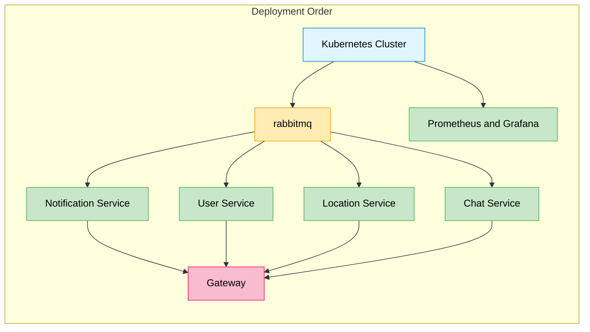

Since our system is composed of multiple microservices, we decided to deploy it on a **Kubernetes cluster**. Kubernetes is an open-source platform designed to automate deploying, scaling, and operating application containers. It is a powerful tool that allows us to manage our microservices in a more efficient way.

In particular the system is mapped on the main abstractions the Kubernetes provides:

- **Deployment**: A Deployment is a higher-level API object that manages the execution of a set of pods. It provides declarative updates to applications, such as rolling updates, scaling, and pausing and resuming processes.
- **Service**: A Service is a resource that provides a stable network endpoint for accessing a set of pods. It acts as an abstraction layer that routes traffic to the appropriate pods, even if these are in status "created", "destroyed", or "moved". In our cluster we have two kind of services: `ClusterIP` and `LoadBalancer`.
  - **ClusterIP**: Exposes the service on a cluster-internal IP. Choosing this value makes the service only reachable from within the cluster.
  - **LoadBalancer**: Exposes the service externally using a cloud provider's load balancer.

Kubernetes also allows to define other resources that can be used to configure data usage inside the cluster:

- **PersistentVolume**: A Persistent Volume Claim (PVC) is a request for storage by a user in Kubernetes. It's similar to how a pod requests CPU and memory resources. PVCs allow users to request specific storage resources (size, access mode) without knowing the details of the underlying storage infrastructure. When a PVC is created, Kubernetes finds an available Persistent Volume (PV) that meets the requirements and binds them together. This provides applications with persistent storage that remains available even if the pod is rescheduled to a different node.
- **ConfigMap**: A ConfigMap is an API object used to store non-confidential data in key-value pairs. This allow you to decouple configuration artifacts from image content to keep containerized applications portable. They can be used to store configuration data that can be consumed by pods or used to configure the system.
- **Secret**: A Secret is an API object used to store sensitive data, such as passwords, OAuth tokens, and SSH keys. Secrets decouple sensitive information from the pods that use it, and they can be mounted into containers as files or accessed by the Kubernetes API.

## Architecture overview

Each microservice is deployed in a separate namespace inside the cluster, this allows to isolate the resources and the network traffic of each service. Each instance then exopose itself, internally, with a service of type `ClusterIP` that is used by the other services to communicate with it.

The architecture of the system is shown below:

```plantuml
@startuml deployment-architecture
scale max 1024 width

skinparam nodesep 10
skinparam ranksep 10

' Kubernetes
!define KubernetesPuml https://raw.githubusercontent.com/dcasati/kubernetes-PlantUML/master/dist

!includeurl KubernetesPuml/kubernetes_Common.puml
!includeurl KubernetesPuml/kubernetes_Context.puml
!includeurl KubernetesPuml/kubernetes_Simplified.puml

!includeurl KubernetesPuml/OSS/KubernetesSvc.puml
!includeurl KubernetesPuml/OSS/KubernetesPod.puml
!includeurl KubernetesPuml/OSS/KubernetesRs.puml
!includeurl KubernetesPuml/OSS/KubernetesDeploy.puml
!includeurl KubernetesPuml/OSS/KubernetesHpa.puml

actor "User" as userAlias
left to right direction

Cluster_Boundary(cluster, "PositionPal Kubernetes Cluster") {
    
    Namespace_Boundary(notification, "Notification Service") {
        KubernetesSvc(notificationSvc, "Service", "")
        KubernetesPod(notification_pod1, "Notification Pod", "")

        KubernetesRs(rs_notification_pod,"Replica Set","")
        KubernetesDeploy(deploy_notification_pod,"Deployment","")
        KubernetesHpa(hpa_notification_pod, "HPA", "")

        Rel(rs_notification_pod,notification_pod1, " ")
        Rel(deploy_notification_pod,rs_notification_pod, " ")
        Rel(hpa_notification_pod,deploy_notification_pod, " ")
        
        Rel(notificationSvc, notification_pod1, " ")
    }

    Namespace_Boundary(gns, "Gateway") {
        KubernetesSvc(gatewaySvc, "Service", "")
        KubernetesPod(gateway_pod1, "Gateway Pod 1", "")

        KubernetesRs(rs,"Replica Set","")
        KubernetesDeploy(deploy,"Deployment","")
        KubernetesHpa(hpa, "HPA", "")

        Rel(gatewaySvc, gateway_pod1, " ")
        Rel_U(rs,gateway_pod1, " ")
        Rel_U(deploy,rs, " ")
        Rel_U(hpa,deploy, " ")
    }

    Namespace_Boundary(uns, "User Service") {
        KubernetesSvc(userSvc, "Service", "")
        KubernetesPod(user_pod1, "User Pod", "")
        KubernetesPod(postgress_pod, "Postgress Pod", "")

        KubernetesRs(rs_user_pod,"Replica Set","")
        KubernetesDeploy(deploy_user_pod,"Deployment","")
        KubernetesHpa(hpa_user_pod, "HPA", "")
        
        KubernetesDeploy(deploy_user_cassandra,"Deployment","")
        

        Rel(userSvc, user_pod1, " ")
        Rel(user_pod1, postgress_pod, " ")

        Rel_U(rs_user_pod,user_pod1, " ")
        Rel_U(deploy_user_pod,rs_user_pod, " ")
        Rel_U(hpa_user_pod,deploy_user_pod, " ")
        
        Rel_U(deploy_user_cassandra,postgress_pod, " ")

        ' Connection between user service and notification
        Rel(user_pod1, notificationSvc, " ")
    }

    Namespace_Boundary(location, "Location Service") {
        KubernetesSvc(locationSvc, "Service", "")
        KubernetesPod(location_pod1, "Location Pod", "")
        KubernetesPod(cassandra_pod_location, "Cassandra Pod", "")

        KubernetesRs(rs_location_pod,"Replica Set","")
        KubernetesDeploy(deploy_location_pod,"Deployment","")
        KubernetesHpa(hpa_location_pod, "HPA", "")

        KubernetesRs(rs_location_cassandra,"Replica Set","")
        KubernetesDeploy(deploy_location_cassandra,"Deployment","")
        KubernetesHpa(hpa_location_cassandra, "HPA", "")
        
        Rel(rs_location_pod,location_pod1, " ")
        Rel(deploy_location_pod,rs_location_pod, " ")
        Rel(hpa_location_pod,deploy_location_pod, " ")

        Rel(rs_location_cassandra,cassandra_pod_location, " ")
        Rel(deploy_location_cassandra,rs_location_cassandra, " ")
        Rel(hpa_location_cassandra,deploy_location_cassandra, " ")

        Rel(locationSvc, location_pod1, " ")
        Rel(location_pod1, cassandra_pod_location, " ")

        ' Connection between location service and notification
        Rel(location_pod1, notificationSvc, " ")
    }

    Namespace_Boundary(chat, "Chat Service") {
        KubernetesSvc(chatSvc, "Service", "")
        KubernetesPod(chat_pod1, "Chat Pod", "")
        KubernetesPod(cassandra_pod_chat, "Cassandra Pod", "")

        KubernetesRs(rs_chat_pod,"Replica Set","")
        KubernetesDeploy(deploy_chat_pod,"Deployment","")
        KubernetesHpa(hpa_chat_pod, "HPA", "")

        KubernetesRs(rs_chat_cassandra,"Replica Set","")
        KubernetesDeploy(deploy_chat_cassandra,"Deployment","")
        KubernetesHpa(hpa_chat_cassandra, "HPA", "")

        Rel(rs_chat_pod,chat_pod1, " ")
        Rel(deploy_chat_pod,rs_chat_pod, " ")
        Rel(hpa_chat_pod,deploy_chat_pod, " ")

        Rel(rs_chat_cassandra,cassandra_pod_chat, " ")
        Rel(deploy_chat_cassandra,rs_chat_cassandra, " ")
        Rel(hpa_chat_cassandra,deploy_chat_cassandra, " ")

        Rel(chatSvc, chat_pod1, " ")
        Rel(chat_pod1, cassandra_pod_chat, " ")
    }

    Rel(userAlias, gatewaySvc, "Interacts")

    ' Connections between services and gateway
    Rel(gateway_pod1, userSvc, " ")
    Rel(gateway_pod1, locationSvc, " ")
    Rel(gateway_pod1, chatSvc, " ")
}
@enduml
```

## Tools used

The deployment of the system involves the use of several tools that allow to automate the process of building and deploying the services.

### Helm

First, all services were defined as Helm charts, providing a standardized package management solution for Kubernetes resources. Each microservice is encapsulated in its own chart, complete with templates, values files, and dependencies. This approach enables consistent deployment across environments with simple configuration changes. Helm charts facilitate version control of our infrastructure and simplify rollbacks when needed. Additionally, using Helm allows us to leverage shared libraries and reduce duplication across our Kubernetes manifests.

The CI/CD process ensures to maintain the Helm charts up-to-date with the codebase, so that the deployment process is always consistent with the latest version of the services and, also, allow to deploy the artifacts to the github container registry in order to be used by the Kubernetes cluster.

### Terraform

To automate the provisioning of the Kubernetes cluster, we used Terraform, an open-source infrastructure as code software tool that provides a consistent CLI workflow to manage cloud services. As we used DigitalOcean as our cloud provider, we leveraged on the terraform provider [plugin](https://registry.terraform.io/providers/digitalocean/digitalocean/latest/docs) for describing the infrastructure that should be created.

In the main configuration file are defined the resources that should be allocated, like the number of nodes, the type of machine, the region and the k8s version:

```hcl
terraform {
  required_providers {
    digitalocean = {
      source = "digitalocean/digitalocean"
      version = "~> 2.0"
    }

    helm = {
      source = "hashicorp/helm"
      version = "~> 2.0"
    }
  }
}

resource "digitalocean_kubernetes_cluster" "k8s_cluster_do" {
  name    = var.k8s_clustername
  region  = var.region
  version = var.k8s_version

  tags = ["k8s"]

  # This default node pool is mandatory
  node_pool {
    name       = var.k8s_poolname
    size       = var.size
    auto_scale = false
    node_count = var.k8s_count
  }
}
```

Each service then is defined in a separate terraform file, that describes the resources that should be created in the cluster, and the configuration to apply to them. For example, the following snippet shows the definition of the `chat` service:

```hcl
resource "helm_release" "chat_service" {
  name       = "chat-service"
  repository = "oci://ghcr.io/position-pal/"
  chart      = "position-pal-chat-service"
  namespace  = "pp-cs"
  version = "1.4.0"

  create_namespace = true

  set {
    name = "rabbitmq.username"
    value = var.rabbitmq_username
  }

  set {
    name = "rabbitmq.password"
    value = var.rabbitmq_password
  }

  set {
    name = "rabbitmq.namespace"
    value = "rabbitmq"
  }

  set {
    name = "rabbitmq.serviceName"
    value = "rabbitmq"
  }
  
  set {
    name = "akkaLicenseKey"
    value = var.akka_license_key
  }

  depends_on = [ helm_release.rabbitmq ]
}
```

Is possible to note that is possible to define also the order of the creation of the resources using the `depends_on` attribute. In this case the `chat` service depends on the `rabbitmq` service, so the `rabbitmq` service is created first. The following diagram shows the deployment order of the services in the cluster:



After creating the infrastructure the first service to be deployed is the `rabbitmq` service, that is used as a message broker by the other services. Parallelly, the monitoring part of the system is deployed, that is composed by the `prometheus` and `grafana` services. After that the other services are deployed, that are the `chat`, `notification`, `user` and `location` services. Finally, the `gateway` service is deployed, that is the entrypoint of the system.

### k3d

To facilitate local development and testing of the infrastructure and Kubernetes configurations, the team used [k3d](https://k3d.io/stable/), a lightweight version of K3s that runs in Docker containers. k3d allows creating and managing multi-node Kubernetes clusters locally without the need for virtual machines or dedicated hardware.

This tool allowed us to:

- Rapidly test the Helm configurations of our services before deploying to production;
- Verify dependencies between services and their interactions in a production-like environment;
- Quickly iterate on Kubernetes configurations without consuming cloud resources.

This approach allowed us to develop with confidence, significantly reducing the risk of issues during production deployment on DigitalOcean.

## Observability of the system using Prometheus and Grafana

To ensure high visibility into the state and performance of microservices running in the Kubernetes cluster, we implemented a comprehensive monitoring solution using Prometheus and Grafana.

### Prometheus Configuration

[Prometheus](https://prometheus.io/) is an open-source monitoring system that collects and stores metrics as time series. In our cluster, it was deployed as part of the monitoring stack with the following features:

- **Service Discovery**: configured to automatically detect services running in the cluster through the Kubernetes API;
- **Storage**: maintains a history of metrics to facilitate trend analysis and troubleshooting.

### Grafana Dashboards and Visualizations

Grafana was configured as a visualization tool for metrics collected by Prometheus. We created several dashboards to monitor different aspects of the system:

- **Cluster Overview**: Visualization of the general state of the cluster, including CPU, memory, and network usage.
- **Microservices Dashboards**: Specific dashboards for each microservice showing:
  - API latency and throughput;
  - Resource usage (CPU, memory);
  - Error rate;
  - Custom business metrics.
- **RabbitMQ Dashboard**: Monitoring of queue status, published/consumed messages, and overall broker health.

Example of a dashboard for the location service:


