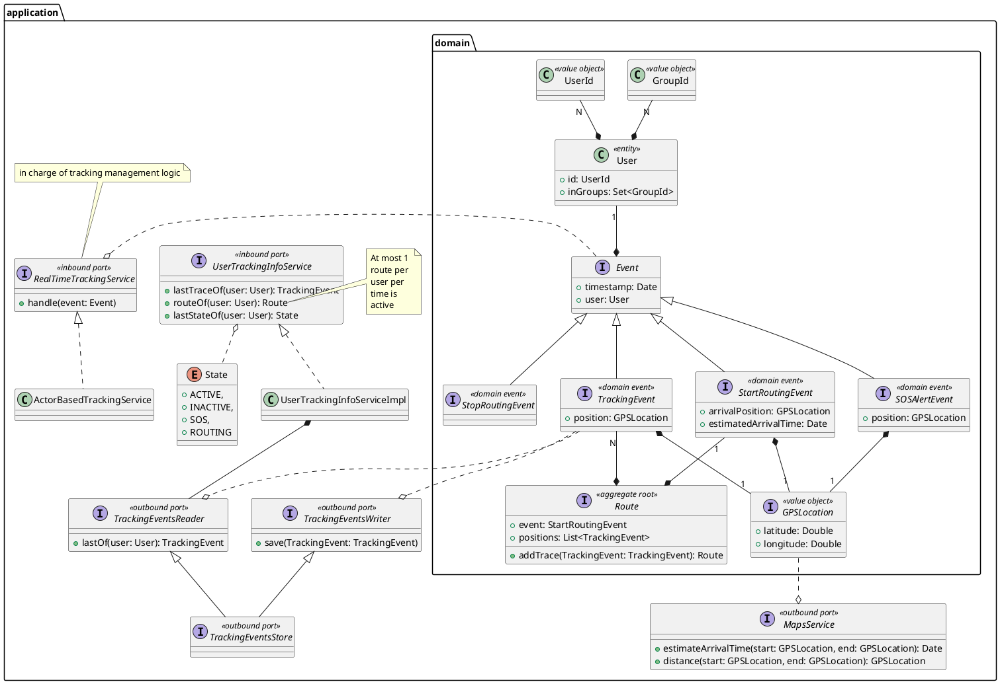
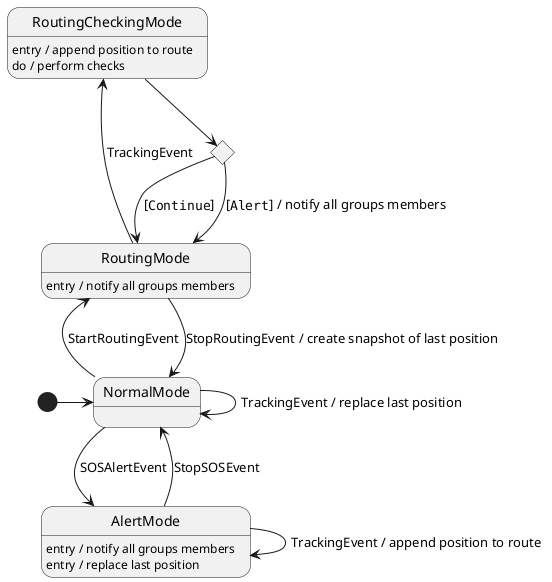
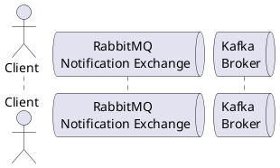

The location service is responsible for location tracking and management.

## Abstract Design

### Main domain concepts (from knowledge crunching)

| Concept | Description | Synonyms |
|---|---|---|
| Location | A specific point on a geographical plane, represented by coordinates that indicates where something / someone is located | Position |
| Route | A set of positions that can be interpolated forming a path between two geographical positions | Path |
| Session | Represent the state and the position of a user at a certain time | Tracking |
| State | State of a user at a certain time, the values that it could assume are: online, offline and SOS | |

### Structure

### Behavior

The active controllers of the system is based on top of Akka actors.

### Interaction

### Architectural Design
