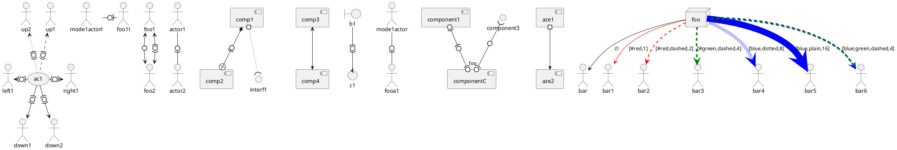

## Location Service Design

`PositionPal` service for location tracking.

```plantuml
@startuml test
actor foo1
actor foo2
foo1 <-0-> foo2
foo1 <-(0)-> foo2
 
(ac1) -le(0)-> left1
ac1 -ri(0)-> right1
ac1 .up(0).> up1
ac1 ~up(0)~> up2
ac1 -do(0)-> down1
ac1 -do(0)-> down2
 
actor1 -0)- actor2
 
component comp1
component comp2
comp1 *-0)-+ comp2
[comp3] <-->> [comp4]

boundary b1
control c1
b1 -(0)- c1

component comp1
interface interf1
comp1 #~~( interf1

:mode1actor: -0)- fooa1
:mode1actorl: -ri0)- foo1l

[component1] 0)-(0-(0 [componentC]
() component3 )-0-(0 "foo" [componentC]

[aze1] #-->> [aze2]

node foo
foo --> bar                             : ∅
foo -[#red,thickness=1]-> bar1          : [#red,1]
foo -[#red,dashed,thickness=2]-> bar2   : [#red,dashed,2]
foo -[#green,dashed,thickness=4]-> bar3 : [#green,dashed,4]
foo -[#blue,dotted,thickness=8]-> bar4  : [blue,dotted,8]
foo -[#blue,plain,thickness=16]-> bar5  : [blue,plain,16]
foo -[#blue;#green,dashed,thickness=4]-> bar6  : [blue;green,dashed,4]
@enduml
```
