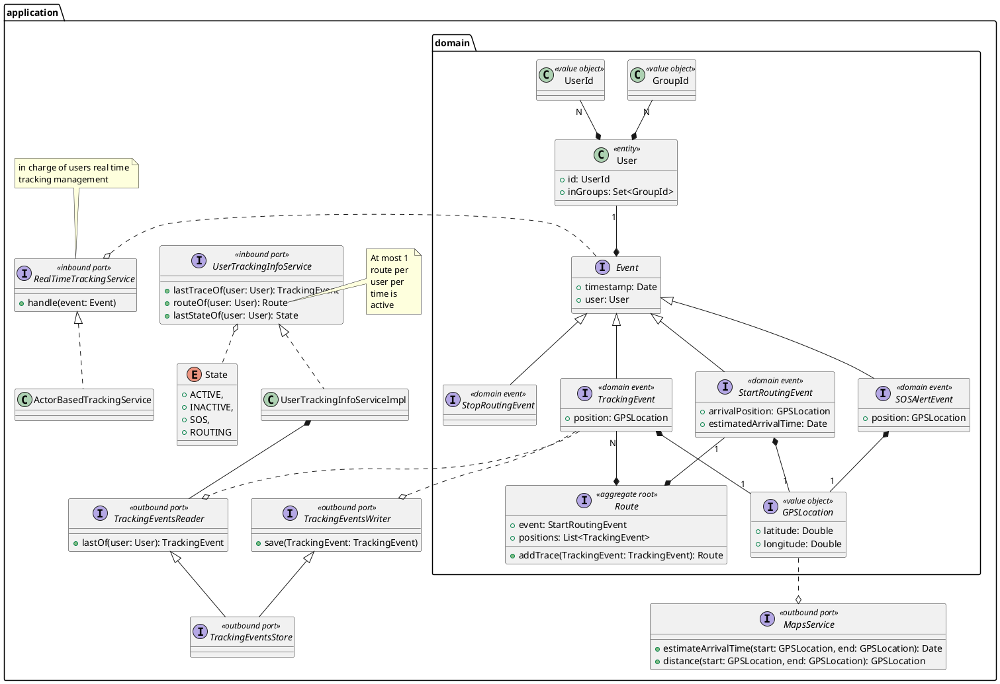
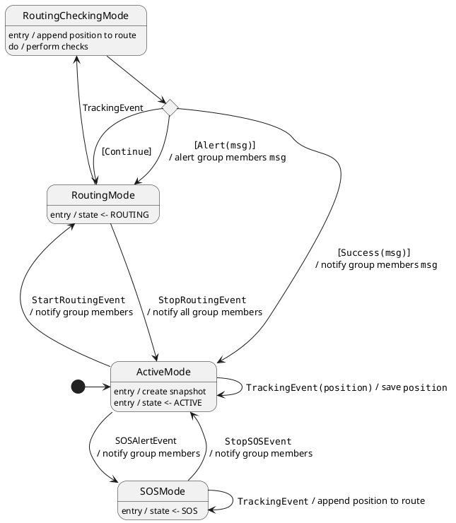
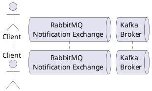
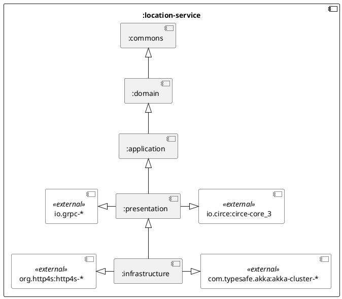

The location service is responsible for location tracking and management.

## Abstract Design

### Main domain concepts (from knowledge crunching)

| Concept | Description | Synonyms |
|---|---|---|
| Location | A specific point on a geographical plane, represented by coordinates that indicates where something / someone is located | Position |
| Route | A set of positions that can be interpolated forming a path between two geographical positions | Path |
| Session | Represent the state and the position of a user at a certain time | Tracking |
| State | State of a user at a certain time, the values that it could assume are: online, offline and SOS | |

### Structure

The main domain concepts are reified in the following classes structure, following the DDD principles.

### Behavior

The active controller of the system is based on top of Akka actors which allows for a scalable and fault-tolerant system without arranging a complex infrastructure for it.

In the above schema is not modelled the `Inactive Mode`: it is fired whenever no updates have been collected for a while (this is handled through timers by the actor).
In such cases the state is changed to `INACTIVE` and if the state before was not the active one (default where everything is ok) an alert (i.e. a notification) is triggered.

<!--

### Interaction

-->

### Architectural Design

The project is structured by implementing hexagonal architecture, mapping layers to Gradle submodules.

